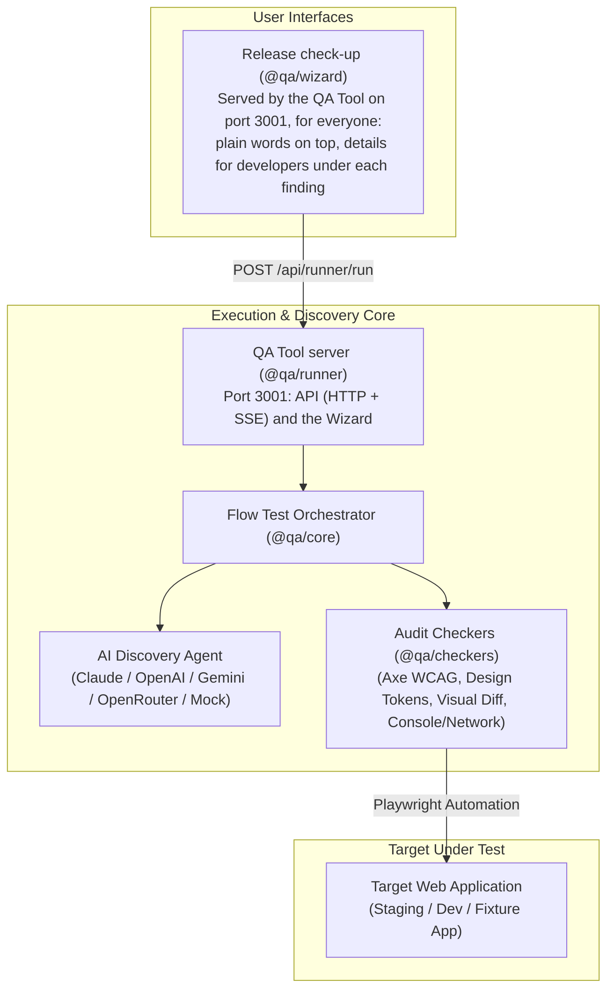

# QA Flow Tester / Pre-Release Readiness Checker 🧪

> **Automated Web Application Discovery, Interactive Flow Testing, and Deterministic Pre-Release Quality Evaluation.**

`qa-flow-tester` is a comprehensive quality assurance platform that automates user flow discovery using AI, validates design token and accessibility conformance, monitors runtime console/network health, captures visual diffs, and aggregates findings into actionable release reports.

---

## 📑 Table of Contents

- [Overview & Architecture](#overview--architecture)
- [Monorepo Structure](#monorepo-structure)
- [Prerequisites](#prerequisites)
- [Quick Start](#quick-start)
  - [1. Clone and Set Up](#1-clone-and-set-up)
  - [2. Start the QA Tool](#2-start-the-qa-tool)
  - [3. Environment Configuration (Optional)](#3-environment-configuration-optional)
- [Running the Applications](#running-the-applications)
  - [One Command (`pnpm start`)](#one-command-pnpm-start)
  - [Working on the Wizard (Hot Reload)](#working-on-the-wizard-hot-reload)
- [End-to-End (E2E) Testing Guide](#end-to-end-e2e-testing-guide)
  - [Step 1: Start the Built-in Test Application](#step-1-start-the-built-in-test-application)
  - [Step 2: Use Release check-up](#step-2-use-release-check-up)
- [Testing & Quality Checks](#testing--quality-checks)
- [Troubleshooting & FAQ](#troubleshooting--faq)

---

## 🏗️ Overview & Architecture

The platform has three layers: the Wizard you use, the server that runs checks, and the engine behind it.



### Core Capabilities

1. **AI Discovery Agent**: Crawls the whole site (up to 200 pages), records which page links to which, and has the AI plan every page, link and journey from what it found (see [ADR 0009](docs/adr/0009-ai-plans-every-plan-item.md)).
2. **Complete plan review**: The plan lists everything a run will do and what won't run, and is exactly what runs. Review it, change it and approve it before anything is tested.
3. **Deterministic Checkers**:
   - **Accessibility**: WCAG 2.2 AA audits via `axe-core`.
   - **Design Token Conformance**: Validates live `getComputedStyle()` against committed `design-tokens.json` (colors, radii, typography).
   - **Visual Baselines**: Perceptual visual diffing across multiple breakpoints (`375px`, `768px`, `1440px`).
   - **Runtime Health**: Intercepts unhandled console errors and failed HTTP network calls.
4. **Checking a fix**: After you fix a problem, run the check-up again on the same address. **Test again** reuses the approved plan, and the finding should no longer appear.

---

## 📦 Monorepo Structure

| Package / Directory                            | Purpose                                                                                                                                                          |
| :--------------------------------------------- | :--------------------------------------------------------------------------------------------------------------------------------------------------------------- |
| [`packages/core`](packages/core)               | Core test orchestration, AI discovery agent, test planner, crawler, benchmarking engine, and AI providers                                                        |
| [`packages/checkers`](packages/checkers)       | Automated checkers (A11y/WCAG, design tokens, visual diffs, console errors, network failures)                                                                    |
| [`packages/runner`](packages/runner)           | The QA Tool server: runs checks over HTTP with Server-Sent Events (SSE) streaming, keeps every check-up's report, and serves the Wizard on the same port         |
| [`packages/wizard`](packages/wizard)           | "Release check-up": the one app, in plain language, with details for developers under each finding ([ADR 0010](docs/adr/0010-one-app-with-details-on-demand.md)) |
| [`packages/types`](packages/types)             | Shared TypeScript type definitions, schemas, and interfaces                                                                                                      |
| [`fixtures/test-app`](fixtures/test-app)       | Built-in target test application (Invoicing app with simulated errors)                                                                                           |
| [`scripts/benchmark.ts`](scripts/benchmark.ts) | Automated benchmark harness measuring check accuracy and planted defect detection                                                                                |

---

## 📋 Prerequisites

Before starting, ensure you have:

- **Node.js**: `v20.x` or `v22.x` (`node -v`)
- **Package Manager**: `pnpm` v9+ (`npm install -g pnpm` or `corepack enable`)
- **Browsers**: Playwright browser binaries

---

## ⚡ Quick Start

### 1. Clone and Set Up

```bash
git clone https://github.com/CJCreator/qa-flow-tester.git
cd "qa-flow-tester"

# Installs dependencies and Playwright's Chromium, then builds every package
pnpm bootstrap
```

Run `pnpm bootstrap` again after every `git pull`. (It isn't called `pnpm setup` because that is a built-in pnpm command.)

### 2. Start the QA Tool

```bash
pnpm start
```

This builds anything that's missing and opens **Release check-up** at **`http://localhost:3001/`** in your browser. Every screen has its own address:

- `/`: a new check-up
- `/reports`: past check-ups, and `/reports/<runId>` for one report
- `/settings`: the AI key

QA Flow Studio was retired ([ADR 0010](docs/adr/0010-one-app-with-details-on-demand.md)): its old address, `/studio`, leads to Past check-ups.

Leave the terminal open while you use it. `pnpm start --no-open` starts without opening a browser. To use another port, set `RUNNER_PORT` first (PowerShell: `$env:RUNNER_PORT=3055; pnpm start`). The QA Tool only answers on this computer (`localhost`).

### 3. Environment Configuration (Optional)

Copy the example environment configuration:

```bash
cp .env.example .env
```

Key environment variables in `.env`:

```env
# AI Providers (at least one key; with none, the plan is written by fixed rules)
OPENROUTER_API_KEY=
ANTHROPIC_API_KEY=
OPENAI_API_KEY=
GEMINI_API_KEY=

# The QA Tool (pnpm start)
RUNNER_PORT=3001

# Needed whenever the QA Tool can be reached beyond this computer
# RUNNER_ACCESS_TOKEN=
# 1 = shared beta (keys in memory only, public sites only); pair with an access token
# RUNNER_BETA=
```

Every setting is listed in [docs/CONFIGURATION.md](docs/CONFIGURATION.md). The rest of the docs are indexed in [docs/README.md](docs/README.md).

---

## 🖥️ Running the Applications

### One Command (`pnpm start`)

`pnpm start` runs the whole tool as one process on one port: the API that runs checks, and the Wizard at `/`.

Data is kept in `.qa-data/` in the working folder (git ignores it): each site's approved plan and answers, and its grade history. Set `RUNNER_DATA_DIR` to keep it elsewhere. Each check-up's report, screenshots and downloads go in `.qa-runner-report/runs/<runId>/` (`RUNNER_OUTPUT_DIR`). The last 10 check-ups of each site are kept; older ones are deleted by themselves, and any can be deleted from Past check-ups.

---

### Working on the Wizard (Hot Reload)

Only needed when you change the Wizard's code. Keep the QA Tool running (`pnpm start`), then:

```bash
pnpm dev   # http://localhost:3002, API calls passed on to the QA Tool on 3001
```

---

### Publish the front end on Vercel

On [vercel.com](https://vercel.com), choose **Add New, Project**, import this repo, and keep the **Root Directory** as the repo root. `vercel.json` sets the install and build commands and the output folder, so there is nothing else to fill in. Every push to `main` publishes the wizard. Opened there, no runner answers it, so its first screen offers the ways to run a check-up (below). Vercel serves only the page: the runner needs a real browser, which Vercel's short-lived functions can't hold for a check-up.

---

### Publish the full app online (free, shared beta)

`render.yaml` publishes the runner and wizard together on Render's free plan, so people open one link, add their **own** AI key, and check a public site. Each visitor's key stays in memory for their session only, and only public sites can be checked.

1. On [render.com](https://render.com), choose **New, Blueprint**, and pick this repo. No card is needed for the free plan.
2. When it is live, copy its address (for example `https://qa-check-up.onrender.com`).
3. In Vercel, open the project's **Settings, Environment Variables** and add `VITE_ONLINE_APP_URL` with that address, then redeploy: the site now shows an **Open the online app** button.

The free plan has 512 MB of memory, sleeps after 15 minutes idle (the first visit then takes about a minute) and runs one check-up at a time. A big site can run out of memory. There are no accounts, and check-ups are limited per visitor and per day, so treat it as a beta.

### Automatic deploys

Nobody deploys by hand. Every push to `main` runs [.github/workflows/deploy.yml](.github/workflows/deploy.yml):

1. **Test.** It builds the site as Vercel does, type-checks the runner and runs the unit tests (not the browser-driven end-to-end test, which takes minutes: run `pnpm test` before a release).
2. **Publish.** Render builds from this repo, so the push itself starts its build (`autoDeploy` in `render.yaml`). Vercel builds from the `CJCreator-New/flowtester` repo, so the workflow copies `main` there once the tests pass, and that starts the Vercel build.
3. **Verify.** It waits for the Vercel site and the Render app to answer, and goes red if either does not.

One-time setup: in this repo's **Settings, Secrets and variables, Actions**, add the secret `VERCEL_REPO_TOKEN`, a fine-grained personal access token that can write **Contents** and **Workflows** on `CJCreator-New/flowtester`. If you would rather Vercel built from this repo directly, import this repo in Vercel instead and delete the Publish job.

---

### Run it in your own GitHub repo (nothing to install)

Open the wizard where it is published on Vercel and choose **In your GitHub repo**. It gives you a workflow file (the same one as [templates/qa-check.yml](templates/qa-check.yml)) to save as `.github/workflows/qa-check.yml`. Then:

1. Add your AI key as a repo secret named `QA_AI_API_KEY` (optional: without it the plan is written by fixed rules).
2. Run **QA check-up** from the Actions tab and type the address. It also runs when a preview or staging deployment succeeds.
3. The verdict is on the run's summary page. Download the **qa-report** artifact and open `report.html`.

It runs on your own Actions minutes (free for public repos, 2,000 a month for private repos on the free plan). A preview or staging address is tested as a test copy; any other address is checked read-only. To run the same thing yourself:

```bash
node packages/runner/dist/checkup.js https://preview.example.com --staging --fail-on blocker
```

See [ADR 0012](docs/adr/0012-hosted-runner-github-actions.md) for why.

---

### Sharing with a few testers (beta)

`pnpm tunnel` is for sharing your own computer with testers. It is not hosting.

For two to four people you know. Your computer runs the checks and stays on while they test.

```bash
pnpm tunnel --beta
```

It prints a **Public** link. Send each tester that link (it carries a private access key, new each time you start). Then:

- Each tester adds **their own AI key** in Settings. It is kept in memory for their session only: never saved to disk, never shared with other testers, gone when you stop the tunnel. Your own saved key and sign-ins are not used.
- Only **public sites** can be checked. Addresses on your computer or network (`localhost`, `192.168.x.x`) are refused.
- One check-up runs at a time. Everyone with the link sees the same reports, and deleting check-ups, schedules and comparisons are closed.
- Testers should only check sites they own. Do not give the link to strangers: there are no accounts; check-ups are limited per visitor and per day.

Without `--beta`, `pnpm tunnel` shares **your** saved AI key with whoever has the link.

---

## 🧪 End-to-End (E2E) Testing Guide

Follow this walkthrough to run and verify a complete test flow end-to-end against the built-in test application.

### Step 1: Start the Built-in Test Application

The repository includes a fixture application (`@qa/fixture-test-app`) with simulated invoices, authentication, and planted defects:

```bash
# In a new terminal window:
cd fixtures/test-app
node server.js
```

The test app will start at: **`http://localhost:3050`**

---

### Step 2: Use Release check-up

1. Start the QA Tool, if it isn't running:
   ```bash
   pnpm start
   ```
2. Use Release check-up, which it opens at `http://localhost:3001/`.
3. The first time, paste an OpenRouter key at the top of the screen (the free tier works). It's checked as you paste it, and nothing else you type is lost. You can replace it later in **Settings**.
4. Enter the site's address. A bare address on this computer or a private network (`localhost:3050`, `192.168.1.5`) gets `http://`; anything else gets `https://`. Once it's checked, the screen shows the address used and which kind of check-up it gets:
   - **Test copy**: forms can be filled in and sent. That needs an address on this computer, a private network or a dev tunnel, or one you marked with **This is a test copy**, and **I own this site** ticked.
   - **Live site**: only looked at, nothing is sent or changed.

   Both choices are remembered for the site. Optionally add specs, design notes or journeys to test, or change **Explore up to N pages** (default 200).

5. Click **Scan the site**. The scan shows live progress with numbers: pages found, layouts, AI requests used and how many are left today, and about how long is left. **Stop scanning** asks first, then goes back with everything still filled in.
6. Review the plan, change it if you like, and approve it. Nothing is tested before you approve (see [The plan review](#the-plan-review) below). Leaving the plan keeps it waiting: the new check-up screen offers it again.
7. Watch the testing: the test count and time left, the page under test, the latest screenshot and what's been found so far. **Stop testing** keeps your plan, so you can approve it again.
8. Read the report. The stamp, **Ready to release** or **Not ready yet**, is the verdict, with its reason; the six areas are graded A–F under it, and an area that wasn't checked says so. Problems are grouped **Must fix before release**, **Should fix** and **Suggestions**. Each has **Details for developers**: the screenshot, steps to reproduce, the page and element, console errors, **Copy bug report**, and **Copy Playwright test**. After you fix something, run the check-up again on the same address: the finding should be gone.
9. **Test again** scans the site again and reuses the plan you approved: if nothing changed, testing starts at once; if something did, only what's new waits for your review. Every report is kept under **Past check-ups**.

#### The plan review

The AI writes the whole plan from what the crawler found. The **Full plan** tab lists every part of it:

- **Summary**: how many tests will run, on how many pages, at which screen sizes, and every default applied. This covers questions answered with the safe answer, items planned by fixed rules, and what won't run. You can also choose the screen sizes here, and see the AI requests used and how many are left today.
- **Pages**: every page found, with its click path from the start page, who reaches it, and the tests the AI planned on it. Pages built from one layout at addresses that only differ by the item they show (such as `/products/…`) are tested through three Sample Pages; **Test this page too** tests any other one on its own. **Add page** adds a page no link reaches.
- **Navigation**: every link, checked once. Shared header, menu and footer links are checked once for the whole site, and each page's own links on that page. A check clicks the link like a person would, and passes when the right page opens and works. Where phones or tablets fold the menu behind a button, the check opens the menu first. Links to other sites are only checked for being broken, with one request each. **Explore this site too** crawls and plans another host the site links to.
- **Journeys**: multi-step things a person does across pages. You can also add a test by describing it.
- **Checks on every tested page**, **Won't run** (with reasons), and **Specs and design notes**.

Every item can be switched on or off, or re-planned with the AI (optionally saying what should change). **Download the plan** saves the whole plan as Markdown for sign-off. The **Map** tab draws the pages and the links between them.

The plan needs an AI key: set one up on the new check-up screen or in **Settings** (OpenRouter's free tier works). Free models allow 20 requests a minute, and 50 a day until the account has bought 10 credits (then 1,000). The plan asks for about one request per three pages, plus one for the shared menus and one for the journeys. Anything past the day's budget is planned by fixed rules, labelled as such, and can be re-planned later. Free models may occasionally produce malformed JSON or hit output token limits; trailing commas are tolerated, while comments, single quotes or unquoted keys safely trigger the Fixed-Rule Fallback. Any fallback item can be re-planned with one click via **Re-plan**. The next run of the same site reuses the approved plan and only asks the AI about pages and links that changed.

---

## 🧪 Testing & Quality Checks

Run the automated test suites:

```bash
# Run unit & integration tests
pnpm test

# Run tests in watch mode
pnpm test:watch

# Format code
pnpm format

# Run planted-defect benchmark
pnpm benchmark
```

---

## 🔍 Troubleshooting & FAQ

### 1. `Cannot find module '...telemetry_hook_bundle.js'`

This occurs if the local Google Cloud telemetry plugin on Windows has invalid path quoting.

- **Fix**: Blank out the hooks file in PowerShell:
  ```powershell
  Set-Content -Path "$HOME\.gemini\config\plugins\googlecloudtools.datacloud_telemetry\hooks.json" -Value "{}"
  ```

### 2. `TimeoutError: waiting for selector ... failed: timeout 30000ms exceeded`

- Check that the target web application is actually running at the specified URL.
- If testing locally via Docker, use `host.docker.internal` instead of `localhost`.
- Check if elements are housed inside an `iframe`.

### 3. `Port 3001 is used by another program`

`pnpm start` says so when something other than the QA Tool holds the port (if the QA Tool is already running, it just opens it).

- Identify and stop the occupying process:
  ```powershell
  # Windows PowerShell:
  Get-Process -Id (Get-NetTCPConnection -LocalPort 3001).OwningProcess | Stop-Process
  ```
- Or use another port: `$env:RUNNER_PORT=3055; pnpm start`.

### 4. The check-up stopped, or its screen says nothing is in progress

- A scan that fails says why, with **Start a new check-up**; what you typed is still there.
- Testing that fails part-way goes back to the plan with what happened above it. Approve the plan again once the site is working.
- Addresses like `/check/plan` only show the check-up in progress. When there's none, open **Past check-ups** for finished ones.

### 5. Playwright Browser Launch Errors

- `pnpm start` stops with a message when the browser is missing. `pnpm bootstrap` installs it. On Linux, system libraries may also be needed:
  ```bash
  pnpm --filter @qa/core exec playwright install chromium --with-deps
  ```

---

## 📄 License

This project is source-available under the [Functional Source License, Version 1.1, MIT Future License](LICENSE) (FSL-1.1-MIT). You can use, copy, modify and redistribute it for any purpose except offering a competing commercial product or service. Each version becomes available under the plain MIT License two years after it is released.
