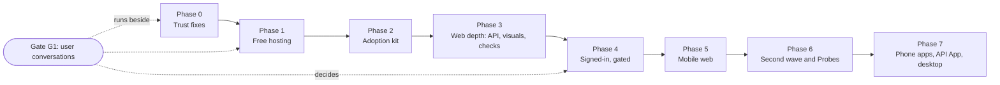

# QA Tool: Phase-by-Phase Plan to an End-to-End Testing Platform

**Date:** 2026-10-05
**Based on:** [`docs/research/e2e-platform-roadmap.md`](./research/e2e-platform-roadmap.md) and clusters `00-brief.md` to `07-mobile-desktop-costs.md`.
**For:** one builder working with AI tools, a few early users, nobody paying yet, $0 hosting budget.
**Goal:** teams with no QA staff paste a URL, get a plain "Ready to release / Not ready yet" verdict they can trust, and walk away with files and code they own.

This file has two parts. **Section 2 is the plan**: phases in order, each with a goal, what ships, effort, an exit gate and a cut line. **Sections 3 to 8 are the item specs** (what to change in which file). Item IDs such as `1.3` are stable names for those specs. The phase numbers in section 2 are the order of work and do not match the spec groupings.

---

## Implementation status

_Last updated 2026-10-07._

The CLI, Report Hub and Dashboard were retired. Mentions of them in the history below describe what was done at the time.

| Phase                              | Status                                                                                                                                       |
| ---------------------------------- | -------------------------------------------------------------------------------------------------------------------------------------------- |
| **0: Stop misleading people**      | **Code complete. Full suite run 2026-10-09: 915/920** (see below)                                                                               |
| **1: Free hosting, first version** | **Code complete, wired to automatic deploys (Vercel front end, Render beta app). First live end-to-end result not yet recorded** (see below) |
| 2 to 7                             | Not started                                                                                                                                  |

### Phase 0: what was done

- **0.2 Axe accuracy (done).** A failed scan is now a visible `F-A11Y-SCAN-FAILED` finding. (While testing, this showed the old empty `catch` hid a real failure: axe rejects pages not made from a browser context.) Every violating element is listed in `evidence.allTargets`. "Incomplete" results appear as "Needs human review" suggestions. Findings cite WCAG criteria. Tap targets under 24 px are the WCAG 2.5.8 failure, and 24 to 44 px is a suggestion labelled as recommended ergonomics. WCAG 2.2 AA wording fixed in `CONTEXT.md`, `README.md` and `PRODUCT_GUIDE.md`.
- **0.4 Security (done).** SameSite is checked independently of Secure (None on a Secure cookie is flagged; None without Secure is Major). Mixed content now also reads what the page actually loaded (CSS `url()`, fonts, fetch/XHR) through Resource Timing.
- **0.3 Clean retry and flaky (done).** The orchestrator runs each test point's open-page-and-steps phase through `RetryRunner.runWithCleanRetry`: a fresh context on the second attempt, no retry on a stop request or on link checks. A flow that fails once and then passes is `FLAKY_PASSED`. It is recorded on the test point (`retry`), counted in `coverage.flakyFlows`, shown in `report.md`, sent to Hub as `retryTelemetry`, stored per run, and summed into the Hub's `flakyFlowsCount` (new "Flaky Flows" card, new `flaky_flows_count` column).
- **0.1 Performance (done).** LCP, CLS and INP come from buffered `PerformanceObserver`s. The old `getEntriesByType` reads returned nothing in Chromium, so the old LCP was always the DOM-ready time. DOM-ready is now reported under its own name ("Slow initial page load"). CLS uses the web.dev session-window algorithm. INP is measured from real interaction entries. A separate probe tab loads the page 3 times (5 if slow) at 150 ms, 1.6 Mbps and 4x CPU slowdown, and reports the median with per-load numbers and spread in `evidence.measurements`. Repeat loads run once per page path per run, at the phone width. Pages over 4 MB get a weight finding with a first-party and third-party split.
- **ADR 0018** written: [adr/0018-claim-wording.md](adr/0018-claim-wording.md).
- **Lab LCP noise** measured before finishing 0.1: [research/lab-lcp-noise.md](research/lab-lcp-noise.md). Single loads vary about 15%, a median of 3 about 20% across batches, so 3 loads plus 2 when slow was kept.

### Phase 0 exit gate

- [x] `pnpm test` is green, with tests for each fix. _Run 2026-10-09: 915 of 920 pass; the 5 failing files were load timeouts (pass alone) and a stale sample report, since regenerated._
- [x] No finding is titled with a metric it did not measure.
- [x] A failed axe scan produces a visible finding, never a clean pass.
- [x] Benchmark precision is the same or better than the baseline. _W3C 24 of 24 real, Books 6 of 6, fixture planted defects 6 of 6. The answer keys in `fixtures/benchmarks/` were updated to the new finding titles. Swag Labs and TodoMVC were not re-run, and the original baseline run was cut short, so those two are unverified._

### Phase 1: what was done

- **Spike answers.** (1) The wizard builds to static files (`VITE_BASE` sets the Pages path). (3) GitHub's billing page, checked 2026-10-05: standard runners are free for public repos, private repos on the Free plan get 2,000 minutes a month, artifact storage is 500 MB. Still open: (2) minutes, CPU and memory of a full check-up on an Actions runner, and (4) free container hosts against the Dockerfile. Both need a real run, so they decide nothing yet. Option A was built because it needs neither.
- **ADR 0012** written: [adr/0012-hosted-runner-github-actions.md](adr/0012-hosted-runner-github-actions.md). It replaces 0008's "one server on each person's machine" as the only way to run.
- **One-shot check-up command** `packages/runner/src/checkup.ts` (`node packages/runner/dist/checkup.js <url>`): starts the runner in-process, tests one address, writes the report, writes the verdict to the Actions job summary, and exits with `--fail-on blocker|major|none`. A preview or staging address (`--staging`) is a test copy; anything else is read-only. Its data folder is outside the report folder so a held key is never uploaded.
- **Workflow template** [templates/qa-check.yml](../templates/qa-check.yml): manual run with an address, plus automatic runs when a preview deployment succeeds. The wizard's first screen (shown when no runner answers, as on Pages) generates it with the typed address, with copy button, secret setup and a link to the repo's Actions page.
- **Front-end publishing:** first GitHub Pages, moved on 2026-10-06 to Vercel (`vercel.json`; the wizard only, the runner stays on Render or the user's Actions). The Pages workflow was removed.
- **Report viewer:** the existing single-file `report.html` is the viewer: it opens offline with a double-click from the downloaded artifact. No separate viewer app was built.
- **Item 1.7 part 4:** the free-key privacy warning is in Settings (OpenRouter free models and Gemini free tier) and printed by the check-up command. The AI Request Budget display already existed on the new check-up screen.
- **`pnpm tunnel`** documented as local-only sharing, not hosting (README, ADR 0012).

### Phase 1 exit gate

- [ ] A new user on a clean repo gets a verdict in under 15 minutes with no local install, using only the Vercel site plus Actions. _Not tried: needs the workflow pushed and a run._
- [ ] Hosting cost is $0, with no card on file. _By design (Vercel and Render free plans); confirm in the Vercel and Render accounts._
- [ ] A run on a private preview URL works. _Not tried._

### Phase 1: the online copy (added after the first Pages review)

The published wizard showed setup instructions instead of the app. The full app is now also set up to run online (Option B, beta), alongside the Actions route:

- `render.yaml` (Render free plan, beta mode), a `/healthz` check for the host, `PORT` and `RENDER_EXTERNAL_URL` support in the runner, and lighter Chromium flags for small hosts.
- The landing screen on the Vercel site shows **Open the online app** when `VITE_ONLINE_APP_URL` is set in the Vercel project (see README).
- Free-host research is in ADR 0012: only Render's free plan fits (512 MB, sleeps when idle). Hugging Face Docker Spaces, Fly.io and Koyeb no longer have a free option without paying or a card.
- The Render service `qa-check-up` is defined in `render.yaml` (free plan, `RUNNER_BETA=1`, `autoDeploy`) and checked by `.github/workflows/deploy.yml` at its default URL. Still unknown: whether Chromium fits in 512 MB on a real site.

### Phase 1: open items

- **To do by hand:** set the repo secrets (`VERCEL_REPO_TOKEN`, and `QA_AI_API_KEY` in the repo that runs the check-up), and run the workflow once on a real site. Record the minutes and memory it uses here, and in ADR 0012.
- **The repo must be public** (or the workflow given a token) for another user's job to download the tool. Decide this before sharing the template.
- **The tool is fetched from `main`.** Pin a release tag once one exists.
- **The check-up workflow has not been run end to end.** The command and wizard were only built, not run on a real site.
- **Dispatch from the browser** was left out (a token on a static page is a risk); the person uses GitHub's Run workflow button.

### Known gaps and notes

- **Missing elements are slow.** A step whose element is absent waits about 35 s per try, because of `locateElement`'s fallback chain, so a failing flow plus its clean retry is slow. Not changed here.
- **A retry repeats a flow's actions.** On a Test Copy, a retried flow that sends a form could create a duplicate record. Live sites send nothing, so they are unaffected. Namespaced test data (item 3.3) is the fix.
- **The "slower than last time" rule** is decided (at least 20% and at least 300 ms) but not built.
- **Hub Postgres:** the new column is added with `ADD COLUMN IF NOT EXISTS`. Only the in-memory path has been read through, not run against a database.
- **Next:** run the full test suite and fix anything it finds (it covers Phases 0 and 1).

---

## Table of Contents

1. [Core Principles & ADRs](#1-core-principles--architectural-decision-records-adrs)
2. [The Phase Plan](#2-the-phase-plan)
3. [Specs A: Fix what misleads (items 0.1-0.4)](#specs-a-fix-what-misleads-phase-0)
4. [Specs B: Web depth (items 1.1-1.7)](#specs-b-web-depth-phases-1-to-4)
5. [Specs C: Mobile web (items 2.1-2.2)](#specs-c-mobile-web-phase-5)
6. [Specs D: Second wave and Probes (items 3.1-3.9)](#specs-d-second-wave-and-probes-phases-4-and-6)
7. [Specs E: Store phone apps (items 4.1-4.4)](#specs-e-store-phone-apps-phase-7)
8. [Specs F: Public API App and desktop (items 5.1-5.2)](#specs-f-public-api-app-and-desktop-phase-7)
9. [Verification commands](#9-verification-commands)

---

## 1. Core Principles & Architectural Decision Records (ADRs)

To prevent breaking existing functionality or violating safety and legal boundaries, every item adheres to these non-negotiables:

1. **Deterministic Execution:** The AI plans and proposes fixes, a person approves, and tests run as plain code.
2. **Safe on Any Site:** Read-only checks inspect what the site already sends. `POST`, `PUT`, `PATCH` and `DELETE` are aborted on live sites. Security Probes run only on **Test Copies** under **Verified Domains**.
3. **No Lock-In:** Every approved Plan can be exported as Playwright (web, API) or Maestro (mobile) code the user owns.
4. **Honest Claims:** The tool never says "compliant" or "secure". It says what was checked and what was not.
5. **$0 until revenue:** no feature may need a paid service to work for the free tier. Real devices and heavy use run on the user's own accounts.

### ADRs, and when each is needed

| ADR  | Subject                                                                      | Replaces / amends                                                        | Write before                                |
| ---- | ---------------------------------------------------------------------------- | ------------------------------------------------------------------------ | ------------------------------------------- |
| 0012 | Hosted runner: where check-ups run, daily limits, what `pnpm tunnel` becomes | Replaces [0008](adr/0008-single-local-server.md)                         | Phase 1                                     |
| 0013 | Opt-in AI explorer and AI-proposed selector fixes (saved as Plans)           | Amends [0009](adr/0009-ai-plans-every-plan-item.md)                      | Phase 6                                     |
| 0014 | Verified Domains and safe host classification                                | New                                                                      | Any shared runner, and Phase 6 Probes       |
| 0015 | Live-site request rules: GraphQL `query` POSTs, GET/HEAD replay, pacing      | Amends [0003](adr/0003-deterministic-safety-filters-for-ai-discovery.md) | Phase 3                                     |
| 0016 | Evidence and redaction: store shapes not bodies, strip secrets, no raw HAR   | New. **Written** for shipped redaction; shapes and HAR still planned     | Phase 3 (and Phase 1 if reports are stored) |
| 0017 | Findings schema and Playwright export contract                               | New                                                                      | Phase 2                                     |
| 0018 | Claim wording ("never compliant, never secure", list what was not checked)   | New                                                                      | Phase 0 (one page). **Written.**            |

---

## 2. The Phase Plan

**Effort:** **S** = a day or two, **M** = about a week, **L** = several weeks. One builder, so phases run one after another. The only thing that runs beside a phase is **Gate G1**, which is calendar time, not build time.

**How "better" is measured.** The repo already has a benchmark (`pnpm benchmark`, script in [scripts/benchmark.ts](../scripts/benchmark.ts), sites in `fixtures/benchmarks/`) that scores how many reported issues are real and how many planted defects are found. Record a baseline score before Phase 0 and again at the end of each phase. A phase that lowers precision (more false findings) does not ship. Fixes in Phase 0 should raise it.



### Phase 0: Stop misleading people

**Why first:** every later feature, and every new user from hosting, sees these numbers. A false INP, or a failed axe scan that reads as a pass, costs trust that is hard to win back.
**Goal:** every number and every "pass" the tool shows is true.
**Ships:** items **0.2** (axe), **0.4** (SameSite, mixed content), **0.3** (retry, flaky passed), **0.1** (performance), the WCAG 2.2 wording fix in `CONTEXT.md` and `PRODUCT_GUIDE.md`, and ADR 0018.
**Order inside the phase:** 0.2 (S), 0.4 (S), 0.3 (S to M), then 0.1 (M). Before 0.1, run one page about 30 times on the machine that will host check-ups, to see how noisy lab LCP is. That result sets the repeat-run count and any "slower than last time" rule.
**Effort:** about 3 weeks.
**Exit gate:**

- `pnpm test` is green, with tests for each fix.
- No finding is titled with a metric it did not measure.
- A failed axe scan produces a visible finding, never a clean pass.
- Benchmark precision is the same or better than the baseline.

**Cut line:** if time runs short, ship 0.2 and 0.4 and mark 0.1 as "performance numbers are indicative". Never ship 0.1 half done, because a half-fixed number is the worst case.
**Risk:** repeat runs make a check-up slower. Run the extra loads only on Sample Pages.

### Phase 1: Free hosting, first version

**Why second:** it is your stated goal now, and "nothing to install" is the promise of the product. It is also the biggest unknown, so it gets a short spike before any build.
**The constraint:** GitHub Pages and similar static hosts cannot launch Chromium. A check-up needs a machine with a browser. So the free design has two parts:

| Part                                                 | Where it can live free                                                                                                                                                     | Notes                                                                                                                                                                                     |
| ---------------------------------------------------- | -------------------------------------------------------------------------------------------------------------------------------------------------------------------------- | ----------------------------------------------------------------------------------------------------------------------------------------------------------------------------------------- |
| Front end: landing page, setup wizard, report viewer | **GitHub Pages**, Cloudflare Pages or Netlify                                                                                                                              | The wizard is a Vite app ([packages/wizard](../packages/wizard)), so it can be built to static files. It must be able to talk to a runner at a chosen address, which it may not do today. |
| Runner: crawls, tests, reports                       | **Option A:** the user's own GitHub Actions run (no server of ours). **Option B:** a free container host running the existing [Dockerfile](../packages/runner/Dockerfile). | A fits "heavy use runs on the user's accounts" and needs no tenant isolation. B gives true zero setup but brings a shared machine, quotas, abuse limits and ADR 0014.                     |

**Recommended first version: Option A.** Pages hosts the wizard and report viewer. The wizard produces a ready-made `.github/workflows/qa-check.yml` and config for the user's repo (or triggers `workflow_dispatch` with a token the user pastes and the browser keeps locally). The run happens on the user's Actions minutes against their preview or staging URL. The report is published as a Pages or Actions artifact and opened in the viewer. This keeps the $0 rule, avoids a shared machine, and removes the need for Verified Domains in this phase. Private test copies work naturally because the user's CI can already reach their preview URL.
**Option B stays a later step**, only if users say Option A is too much setup.

**Spike first (S, 2 to 3 days). The answers decide Option A vs B, so do not skip it:**

1. Build the wizard to static files and open it from Pages.
2. Run `pnpm bootstrap` and a full check-up inside a GitHub Actions job. Record minutes, CPU and memory.
3. Check GitHub's current pricing page for how many free Actions minutes a public repo and a free-plan private repo get. The research did not verify this.
4. Check one or two free container hosts against the Dockerfile (memory for Chromium, sleep behaviour, daily limits). The research found Oracle's free tier halved in June 2026, so do not rely on one host.

**Ships (after the spike):** ADR 0012, static wizard on Pages, workflow template generated by the wizard, a report viewer that opens the JSON/HTML report, free-key privacy warning and AI Request Budget display (item **1.7**, part 4), and `pnpm tunnel` documented as local-only.
**Effort:** spike S, build M to L.
**Exit gate:**

- A new user on a clean repo gets a verdict in under 15 minutes with no local install, using only Pages plus Actions.
- Hosting cost is $0, with no card on file.
- A run on a private preview URL works.

**Cut line:** if the wizard cannot trigger runs from the browser, ship "copy this workflow file" plus the viewer. That is still nothing to install.
**Risk:** a user token pasted into a static page must stay in their browser only. If that cannot be done safely, drop the dispatch button.

### Gate G1: user conversations (calendar time, starts now)

**Goal:** replace guesses with answers before Phase 4, and check Phase 1's assumptions.
**Do:** 3 to 5 conversations with current users. Use the 8 "signed-in" questions in [roadmap section 7](research/e2e-platform-roadmap.md) and ask for a real example of each, not an opinion. Add these:

- Would they run a check-up in their own GitHub Actions? Do they use GitHub at all?
- Staging or preview URLs, or production only?
- Do they already have Playwright suites?
- Would they paste a per-finding brief into an AI coding tool?

**Output:** a half-page note in `docs/research/` with counts and quotes, and a decision on Phase 4.
**Rule:** do not build beyond sign-in detection and wording until two or more users give the same real example.

### Phase 2: Adoption kit

**Goal:** a user can keep what the tool gives them, and use it in the tools they already have.
**Ships:** a `LICENSE` file (the public repo has none; FSL as decided) (S), items **1.1** (findings contract, release record, CI exit code, workflow template) and **1.2** (Playwright export of the approved Plan), ADR 0017. The API tests in the export (`api-traffic.spec.ts`) wait for Phase 3.
**Effort:** 1.1 M, 1.2 M, licence S.
**Exit gate:**

- `findings.json` validates against the published JSON Schema.
- The Playwright export runs unchanged with `npx playwright test` on the benchmark fixture.
- `--fail-on blocker` exits non-zero on a known-bad fixture.
- The single-file share export opens offline.

**Cut line:** drop the trend strip and `known-findings.json` first. Keep the exit code, the schema and the export.
**Risk:** an export that does not run as is destroys the "no lock-in" story. Treat "runs as is" as a release blocker.

### Phase 3: Web depth, the differentiators

**Goal:** the checks no free point tool gives a small team.
**Ships, in this order:**

1. ADRs 0015 and 0016, then item **1.3** (API traffic capture, redaction, shapes, passive checks, diffs, GET/HEAD replay) (L). Redaction ships in the same commit as capture.
2. Item **1.4** (visual baselines: approve button, page stabilising, masking) (M).
3. Item **1.5** (keyboard and focus checks, 320 px reflow, CrUX panel, page weight, read-only security) (M). Each part is independent, so ship them one at a time.
4. The API half of the Playwright export.

**Effort:** about 8 to 10 weeks.
**Exit gate:**

- Benchmark shows the planted API defects found and no new false findings.
- A search of stored reports for planted fake tokens and cookies finds none.
- A visual baseline can be approved from the report.
- No new check sends a request a plain visit would not send, except GET/HEAD replay on the user's own roles.

**Cut line:** if 1.3 is too large, ship capture, redaction and the four no-extra-request checks (hidden errors, slow endpoints, shape drift, error-body leaks) and defer replay.
**Risk:** the live-site GraphQL decision (ADR 0015). If undecided, GraphQL sites silently fail, so decide it first.

### Phase 4: Signed-in work (gated by G1)

**Goal:** signed-in checks that match what users actually mean.
**Always ships:** item **1.6** (test sign-in button, two-step and modal sign-in, clear "why it failed" wording). This is the cheap "hard to set up" fix.
**Ships only if G1 shows it:** deeper journeys and namespaced test data on Test Copies (the "too shallow" case, item **3.3**), or blocked-sign-in handling (roadmap row 25, never CAPTCHA solving).
**Effort:** 1.6 M. The rest depends on G1.
**Exit gate:** each sign-in failure on the benchmark fixtures gets one of four named reasons: form not found, wrong credentials, blocked by a challenge, session not kept.

### Phase 5: Mobile web

**Goal:** a second real engine without a device grid.
**Ships:** item **2.1** (WebKit and Firefox on Sample Pages, labelled "WebKit (Playwright build)", never "Safari"), then item **2.2** (Android Chrome in the user's CI).
**Effort:** 2.1 M, 2.2 M.
**Exit gate:** baselines are stored per engine, and no report uses the word "Safari" for the WebKit build.
**Note:** this fits Phase 1's Option A well, because the runs already happen in the user's CI.

### Phase 6: Second wave, then Probes

**Goal:** depth for users who are already happy.
**Ships, in any order, one at a time:** **3.2** re-run only what failed or changed, **3.4** accessibility checklist and draft statement, **3.5** consent and Global Privacy Control, **3.6** TLS and mail DNS checks, **3.7** OpenAPI check, **3.8** SARIF, **3.1** AI-proposed selector fixes with ADR 0013.
**Last, and only after legal review:** **3.9** Security Probes, which need ADR 0014 and Verified Domains (the rest of item **1.7**) first.
**Exit gate for 3.9:** Probes refuse to run on a host that is not a Test Copy under a Verified Domain, proven by a test.
**Cut line:** 3.9 can be cut entirely. Users can connect ZAP or Nuclei themselves.

### Phase 7: Beyond the website

**Ships:** store phone apps through Maestro (items **4.1** to **4.4**), then the public API as its own App (**5.1**), then desktop via Electron (**5.2**) only when a user asks.
**Entry gate:** at least two users who ship a phone app say they would use it, and it is clear whether they have a Mac or use EAS (Expo's build service).
**Cut line:** real iPhone runs and device farms are never built. Connect to the farm the user already pays for.

### What is deliberately not in any phase

CAPTCHA solving, a visual-AI engine, test management, SSO and audit logs, a GitHub App, load testing, gRPC, an automatic VPAT, overlays. Reasons are in the roadmap's gap table (rows 26, 31, 36, 44, 46, 47, 50, 51).

### Risks that cut across phases

| Risk                                | Effect                             | Mitigation                                                                             |
| ----------------------------------- | ---------------------------------- | -------------------------------------------------------------------------------------- |
| Free hosting terms change           | Hosting breaks                     | Option A needs no server of ours; keep the Dockerfile working as the fallback          |
| Scope creep from the gap table      | One builder never finishes a phase | Each phase has a cut line; add nothing mid-phase                                       |
| Free AI key limits and training use | Surprise privacy or quota problems | Show the warning and AI Request Budget (Phase 1)                                       |
| Legal exposure from Probes          | Liability                          | Phase 6 only, behind Verified Domains and counsel's review                             |
| Roadmap facts going stale           | Wrong decisions                    | The roadmap lists claims to verify; check the relevant ones at the start of each phase |

### Not yet checked

Check these at the start of the phase that depends on them. The research did not settle them:

- GitHub Actions free minutes for public and private repos (Phase 1)
- Free container host limits (Phase 1)
- Memory and CPU one real check-up uses (Phase 1)
- Gemini free-tier limits (Phase 1)
- How noisy lab LCP is on the chosen machine (Phase 0)
- Licence fit of axe-core (MPL-2.0), Pa11y (LGPL-3.0), MobSF (GPL-3.0) and k6 (AGPL-3.0) with FSL (Phase 2)

---

## Specs A: Fix what misleads (Phase 0)

> **Priority:** Immediate (Must ship before any new features)  
> **Goal:** Eliminate incorrect metrics, false passes, and uncalibrated findings that mislead users.

### Item 0.1: Performance Metric Accuracy

_Reference: Roadmap Gap Table Row 1, Cluster 04 ([04-performance-cwv.md](./research/e2e-platform/04-performance-cwv.md))_

- **Problem in Codebase:**
  - In [`packages/checkers/src/performance.ts`](../packages/checkers/src/performance.ts):
    - `inpMs` is declared in the interface but never measured or populated in `collectMetrics()`.
    - If no `largest-contentful-paint` entry exists, it falls back to `nav.domContentLoadedEventEnd` and still titles the finding "Slow Largest Contentful Paint".
    - `cls` is calculated as a lifetime sum (`cls += s.value`), which drastically overstates layout shifts on long pages compared to web.dev's 5s session window algorithm.
    - Tests run on a single unthrottled load without repeat runs or medians.
    - `SPEED_THRESHOLDS.MAX_PAGE_WEIGHT_BYTES` (4 MB) is defined but never evaluated against `totalWeightBytes`.
- **Implementation Spec:**
  1. **Real Lab INP / Interaction Timing:**
     - In `collectMetrics(page)`, attach a `PerformanceObserver` listening for `event` entries (`duration`, `processingStart`, `processingEnd`) or simulate a standardized click/keyboard interaction on the primary CTA and measure interaction latency.
     - Report `inpMs` accurately against `SPEED_THRESHOLDS.INP_GOOD_MS` (200ms) and `SPEED_THRESHOLDS.INP_POOR_MS` (500ms).
  2. **Accurate LCP Without Fake Fallbacks:**
     - Retrieve LCP strictly from `largest-contentful-paint` performance entries.
     - If no LCP entry is captured, do **not** report `domContentLoadedEventEnd` as LCP. Either record DOMContentLoaded under its true name ("Slow Initial DOM Load") or emit a diagnostic notice that LCP was not observed.
  3. **Session Window CLS Algorithm:**
     - Implement the web.dev session window algorithm: group shifts into windows where shifts are separated by less than 1 second, with a maximum window duration of 5 seconds. Take the maximum score across all session windows.
  4. **CDP Simulated Throttling:**
     - Add CDP session initialization via Playwright (`page.context().newCDPSession(page)`).
     - Apply simulated mobile network throttling: 150ms RTT, 1.6 Mbps download, 750 Kbps upload (`Network.emulateNetworkConditions`).
     - Apply simulated CPU throttling: 4x CPU slowdown (`Emulation.setCPUThrottlingRate`).
  5. **Repeat Runs & Median Calculation:**
     - Execute 3 loads (or 5 for failing pages) per Sample Page for performance measurements.
     - Calculate the median for LCP, CLS, and INP. Record the variance in findings evidence.
  6. **Page Weight Enforcement:**
     - Compare `totalWeightBytes` against `SPEED_THRESHOLDS.MAX_PAGE_WEIGHT_BYTES`.
     - Flag pages exceeding 4 MB, providing a breakdown of first-party vs third-party assets in `evidence`.
- **Files to Modify:**
  - [`packages/checkers/src/performance.ts`](../packages/checkers/src/performance.ts)
  - [`packages/checkers/tests/performance.test.ts`](../packages/checkers/tests/performance.test.ts)
- **Acceptance Criteria:**
  - [x] `inpMs` is populated from real performance entries or simulated interaction.
  - [x] No finding titles `domContentLoadedEventEnd` as "Largest Contentful Paint".
  - [x] CLS matches web.dev session window burst calculation.
  - [x] Performance measurements use CDP network & CPU throttling with multi-run medians.
  - [x] Transfer sizes > 4 MB generate an asset weight finding.

---

### Item 0.2: Axe Accessibility Checker Accuracy

_Reference: Roadmap Gap Table Row 2, Cluster 03 ([03-accessibility-compliance.md](./research/e2e-platform/03-accessibility-compliance.md))_

- **Problem in Codebase:**
  - In [`packages/checkers/src/ux-quality.ts`](../packages/checkers/src/ux-quality.ts):
    - Axe execution errors are caught in an empty `catch {}` block, causing broken scans to appear as clean passes.
    - Only `violation.nodes[0]` is reported; all other failing elements for that rule are discarded.
    - `axeResults.incomplete` ("needs human review") is completely ignored.
    - Findings only reference internal axe rule IDs without citing WCAG criterion numbers.
    - Tap target check evaluates against 44px without noting that WCAG 2.2 AA (Criterion 2.5.8) specifies 24x24px (44px is Level AAA / Apple HIG).
    - Code runs `wcag22aa` but documentation/glossary still claims WCAG 2.1 AA.
- **Implementation Spec:**
  1. **Visible Scan Failure Diagnostic:**
     - Replace empty `catch` with structured error handling. If axe fails to inject or execute (e.g. strict CSP, non-HTML page), record an explicit diagnostic finding: `F-A11Y-SCAN-FAILED` with severity `Major`.
  2. **Full Element Violation Reporting:**
     - Report all violating elements in `evidence.allTargets` and summarize in `actual`: e.g. "Violated by 4 elements on this page: `#cta-btn`, `.nav-link`, etc.".
  3. **Surface Incomplete Items as "Needs Human Review":**
     - Collect `axeResults.incomplete`. Expose them in the report as an informational/advisory section ("Checks requiring manual review") rather than false passes or synthetic failures.
  4. **WCAG Success Criteria Mapping:**
     - Map axe rule tags to standard WCAG criteria (e.g., `wcag143` -> `WCAG 1.4.3 Contrast (Minimum) Level AA`). Include criterion numbers in finding title and description.
  5. **Tap Target Clarification:**
     - Label the 24px threshold as WCAG 2.2 AA minimum. If flagging 44px, clearly mark it as "Recommended Mobile Ergonomics (AAA / Platform Standard)", not an AA failure.
  6. **Doc Harmonization:**
     - Update [`CONTEXT.md`](../CONTEXT.md) and [`docs/PRODUCT_GUIDE.md`](../docs/PRODUCT_GUIDE.md) to accurately state WCAG 2.2 AA.
- **Files to Modify:**
  - [`packages/checkers/src/ux-quality.ts`](../packages/checkers/src/ux-quality.ts)
  - [`packages/checkers/tests/ux-quality.test.ts`](../packages/checkers/tests/ux-quality.test.ts)
  - [`CONTEXT.md`](../CONTEXT.md)
- **Acceptance Criteria:**
  - [x] Axe exceptions produce a visible diagnostic finding.
  - [x] All violating nodes per rule are captured in evidence.
  - [x] Incomplete axe items are categorized under "Needs Human Review".
  - [x] Findings cite WCAG criterion numbers (e.g., WCAG 2.4.7, 1.4.3).
  - [x] Tap target rule distinguishes 24px (AA) from 44px (AAA).

---

### Item 0.3: Wire Clean Flow Retry & Flaky Passed

_Reference: Roadmap Gap Table Row 3, Cluster 01 ([01-web-e2e-ai-testing.md](./research/e2e-platform/01-web-e2e-ai-testing.md))_

- **Problem in Codebase:**
  - [`packages/core/src/retry-runner.ts`](../packages/core/src/retry-runner.ts) implements `runWithCleanRetry`, but it is never called by [`orchestrator.ts`](../packages/core/src/orchestrator.ts).
  - In [`packages/hub/src/storage/db.ts`](../packages/hub/src/storage/db.ts) and [`packages/hub/src/ui.ts`](../packages/hub/src/ui.ts), `flakyFlowsCount` is hardcoded to `0`.
- **Implementation Spec:**
  1. **Orchestrator Integration:**
     - In [`packages/core/src/orchestrator.ts`](../packages/core/src/orchestrator.ts), wrap journey flow executions with `RetryRunner.runWithCleanRetry`.
     - When an execution fails on attempt 1 but succeeds on attempt 2 with a clean context, record flow status as `FLAKY_PASSED`.
  2. **Hub & Reporter Metrics:**
     - Pass the count of `FLAKY_PASSED` flows into the run report summary and Hub database.
     - Replace hardcoded `flakyFlowsCount: 0` in Hub queries and UI components with the aggregated tally.
- **Files to Modify:**
  - [`packages/core/src/orchestrator.ts`](../packages/core/src/orchestrator.ts)
  - [`packages/hub/src/storage/db.ts`](../packages/hub/src/storage/db.ts)
  - [`packages/hub/src/ui.ts`](../packages/hub/src/ui.ts)
  - [`packages/core/src/reporter.ts`](../packages/core/src/reporter.ts)
- **Acceptance Criteria:**
  - [x] Flaky test runs pass on clean retry and are tagged `FLAKY_PASSED`.
  - [x] Reports and Hub UI display the true `flakyFlowsCount`.

---

### Item 0.4: Security Cookie & Mixed Content Fixes

_Reference: Roadmap Gap Table Row 4, Cluster 05 ([05-security.md](./research/e2e-platform/05-security.md))_

- **Problem in Codebase:**
  - In [`packages/checkers/src/security.ts`](../packages/checkers/src/security.ts) line 203: The `SameSite` check is nested inside `if (!cookie.secure)`, completely missing `SameSite=None` on a cookie that has `Secure: true`.
  - Mixed content only scans HTML attributes, missing CSS `url()` references and script-initiated fetches over HTTP.
- **Implementation Spec:**
  1. **Decouple SameSite Check:**
     - Separate the `SameSite` evaluation from the `!cookie.secure` branch.
     - Flag `SameSite=None` on any cookie as `Minor` (or `Major` if sensitive/session-related).
     - Flag missing `SameSite` attribute as `Minor`.
     - Flag `SameSite=None` _without_ `Secure` as `Major` (violates modern browser cookie security).
  2. **Comprehensive Mixed Content:**
     - Inspect all network responses recorded in `stepEvidenceList` / network entries.
     - If the page URL is HTTPS, flag any loaded resource with `http://` scheme (covering CSS `@import`, `url()`, fonts, WebSockets, and `fetch`/XHR calls).
- **Files to Modify:**
  - [`packages/checkers/src/security.ts`](../packages/checkers/src/security.ts)
  - [`packages/checkers/tests/security.test.ts`](../packages/checkers/tests/security.test.ts)
- **Acceptance Criteria:**
  - [x] `SameSite=None` on a `Secure` cookie produces a finding.
  - [x] HTTP network requests triggered by CSS or scripts on HTTPS pages produce a mixed content finding.

---

## Specs B: Web depth (Phases 1 to 4)

> **Priority:** High  
> **Goal:** Solidify the "Plan -> Run -> Verify -> Export" core loop, deliver API traffic intelligence from crawls, visual approvals, and CI defect handoff without external service dependencies.

### Item 1.1: Findings Contract, CI Integration & Trend Reporting

_Reference: Roadmap Gap Table Rows 18, 19, 20, Cluster 02 ([02-visual-crossbrowser-reporting.md](./research/e2e-platform/02-visual-crossbrowser-reporting.md))_

- **Implementation Spec:**
  1. **Findings Contract (`findings.schema.json` & `schemaVersion`):**
     - Add `schemaVersion: "1.0.0"` to [`packages/types/src/index.ts`](../packages/types/src/index.ts) `RunReport` and `Finding`.
     - Generate and publish `findings.schema.json` in the root repository.
     - Write deterministic `fingerprint` (hash of checker + rule + normalized path + selector) into every finding in `findings.json`.
  2. **AI Coding Agent Defect Briefs:**
     - In [`packages/core/src/reporter.ts`](../packages/core/src/reporter.ts), emit:
       - Individual brief files: `findings/F-XXX.md` formatted specifically for Claude Code, Cursor, and Copilot (containing title, severity, target URL/selector, exact expected vs actual, repro command, likely source location, and `qa-test verify <id>`).
       - `fix-these.md`: An ordered task list of all Blockers and Majors with instructions for an AI tool to fix them sequentially.
       - `AGENTS.md` snippet: Recommended instructions users can commit to their repository root for AI agent workflows.
  3. **Committed Triage (`known-findings.json`):**
     - Support a committed `known-findings.json` in user repos storing accepted risks / "not a problem" findings with rationale. The CLI reads this to suppress known items during CI.
  4. **Release Record & Historical Trend Strip:**
     - Add a "Release Record" header to Markdown/HTML reports: Target, Approver, Timestamp, Final Verdict, Known Findings Summary.
     - Extract historical scores from [`site-history.ts`](../packages/core/src/site-history.ts) and render a sparkline/trend strip showing 6-area scores across the last 10 runs.
  5. **CI Release Gate & GitHub Integration:**
     - In [`packages/cli/src/index.ts`](../packages/cli/src/index.ts), add `--fail-on <blocker|major|none>` flag.
     - If findings match or exceed the threshold, terminate with exit code `1`.
     - When running in GitHub Actions (`GITHUB_ACTIONS=true`):
       - Append formatted summary to `process.env.GITHUB_STEP_SUMMARY`.
       - Emit workflow annotations: `::error file=...::` and `::warning file=...::`.
     - Add `.github/workflows/qa-preview.yml` template waiting for `deployment_status`.
- **Files to Modify / Create:**
  - [`packages/types/src/index.ts`](../packages/types/src/index.ts)
  - [`packages/core/src/reporter.ts`](../packages/core/src/reporter.ts)
  - [`packages/core/src/html-report.ts`](../packages/core/src/html-report.ts)
  - [`packages/cli/src/index.ts`](../packages/cli/src/index.ts)
  - [`findings.schema.json`](../findings.schema.json)
  - [`.github/workflows/qa-preview.yml`](../.github/workflows/qa-preview.yml)
- **Acceptance Criteria:**
  - [x] `findings.json` includes `schemaVersion` and `fingerprint`.
  - [x] `findings/F-XXX.md` and `fix-these.md` are generated on every run.
  - [x] CLI exits with non-zero code when `--fail-on` criteria are met.
  - [x] GitHub Actions step summary and annotations render properly in CI.

---

### Item 1.2: Standalone Playwright Test Suite Export

_Reference: Roadmap Gap Table Row 5, Cluster 01 ([01-web-e2e-ai-testing.md](./research/e2e-platform/01-web-e2e-ai-testing.md))_

- **Implementation Spec:**
  1. **Playwright Exporter Module (`packages/core/src/export/playwright-export.ts`):**
     - Convert an approved `TestPlan` into a clean, standalone Playwright project structure:
       ```
       e2e-tests/
       ├── playwright.config.ts
       ├── auth.setup.ts
       ├── tests/
       │   ├── guest.spec.ts
       │   ├── member.spec.ts
       │   └── api-traffic.spec.ts
       └── package.json
       ```
  2. **Role & Auth State Architecture:**
     - Generate `auth.setup.ts` using Playwright's `storageState` pattern for each defined role.
     - Extract credentials into environment variables (`process.env.QA_USER_EMAIL`, etc.).
  3. **High-Resilience Locators:**
     - Emit locators using Playwright's recommended order: `page.getByRole(...)`, `page.getByTestId(...)`, `page.getByText(...)`, with CSS selectors only as a fallback.
  4. **API Assertions as `request` Tests:**
     - Export verified API calls from traffic analysis (Item 1.3) into `api-traffic.spec.ts` using Playwright's `request` context.
  5. **CLI Command:**
     - Add `qa-test export playwright --output <dir>` to generate the suite.
- **Files to Create:**
  - `packages/core/src/export/playwright-export.ts`
  - `packages/cli/src/commands/export.ts`
  - `packages/core/tests/playwright-export.test.ts`
- **Acceptance Criteria:**
  - [x] Exported suite runs out-of-the-box with `npx playwright test`.
  - [ ] Multi-role sessions use storage state and environment variables.
  - [ ] Locators adhere to Playwright accessibility/role best practices.

---

### Item 1.3: Recorded API Traffic Intelligence & Zero-Request Checks

_Reference: Roadmap Gap Table Rows 7-11, Cluster 06 ([06-api-testing.md](./research/e2e-platform/06-api-testing.md))_

- **Implementation Spec:**
  1. **Expanded Traffic Capture:**
     - In [`packages/core/src/evidence.ts`](../packages/core/src/evidence.ts), expand `page.on('response')` to capture: timing breakdown (DNS, TTFB, download), `content-type`, request/response headers, initiator type (`fetch`, `xhr`, `document`), and status.
  2. **Strict Privacy Redaction Before Disk (ADR 0016):**
     - Sanitize all headers: strip `Cookie`, `Set-Cookie`, `Authorization`, `Proxy-Authorization`.
     - Detect and redact JWTs and API key patterns in query params and bodies.
     - Persist structural JSON schema/shape rather than raw body payloads.
  3. **Endpoint Parameter Clustering:**
     - Cluster dynamic paths into parameterized route templates:
       - `/api/orders/9482` and `/api/orders/1029` -> `/api/orders/{id}`
       - `/api/users/c3b1e...` -> `/api/users/{uuid}`
  4. **Zero-Request Passive Checks:**
     - **Hidden Errors:** HTTP 200 with GraphQL `errors` array or `{ "error": ... }` response bodies.
     - **Slow Endpoints:** Flag endpoints with TTFB > 1000ms (Degraded) or > 2000ms (Failed).
     - **Information Leaks:** Detect database/stack trace messages in 4xx/5xx response bodies.
     - **Shape Drift:** Diff JSON response shapes against historical runs in `site-history.ts`. Flag added/removed/type-changed fields (require removals to persist across 2 check-ups).
  5. **GraphQL Live Site Policy (ADR 0015):**
     - In [`packages/core/src/live-site.ts`](../packages/core/src/live-site.ts), parse POST bodies. If the payload is a valid GraphQL `query` (read-only), allow it on live sites. Continue blocking GraphQL `mutation` operations.
  6. **Passive Replay Verification (GET / HEAD only):**
     - **Unauthenticated Replay:** Replay captured authenticated GET without session tokens. If it responds with 200 and data, raise "Authenticated route lacks authorization check".
     - **Cross-Role Replay (BOLA):** Replay role A's GET using role B's credentials to verify object-level authorization.
- **Files to Modify / Create:**
  - [`packages/core/src/evidence.ts`](../packages/core/src/evidence.ts)
  - [`packages/core/src/redact.ts`](../packages/core/src/redact.ts)
  - [`packages/core/src/live-site.ts`](../packages/core/src/live-site.ts)
  - `packages/checkers/src/api-traffic.ts`
  - `packages/checkers/tests/api-traffic.test.ts`
- **Acceptance Criteria:**
  - [ ] Captures TTFB, headers, content-type, and XHR/fetch status.
  - [ ] Redacts tokens/cookies prior to writing to disk.
  - [ ] Flags HTTP 200 GraphQL errors and slow endpoints.
  - [ ] Allows GraphQL query POSTs on live sites while blocking mutations.
  - [ ] Replays GET endpoints across roles to catch authorization leaks.

---

### Item 1.4: In-Browser Visual Baseline Approval & Noise Masking

_Reference: Roadmap Gap Table Row 15, Cluster 02 ([02-visual-crossbrowser-reporting.md](./research/e2e-platform/02-visual-crossbrowser-reporting.md))_

- **Implementation Spec:**
  1. **In-Report Baseline Review:**
     - Update [`packages/core/src/html-report.ts`](../packages/core/src/html-report.ts) to display interactive side-by-side comparisons: Baseline, Current Screenshot, and Pixelmatch Diff.
     - Provide an "Approve as New Baseline" button in the local dashboard / report that updates the reference baseline file on disk.
  2. **Page Stabilization:**
     - Before capturing screenshots: wait for `document.fonts.ready`, wait for `networkidle`, and inject CSS to disable animations (`* { animation: none !important; transition: none !important; }`).
  3. **Automated Noise Masking:**
     - Automatically mask elements identified as timestamps, dates, dynamic ads, and cookie banners.
     - Allow users to supply CSS selectors in Plan Review to mask specific unstable elements.
  4. **Machine-Tagged Baselines:**
     - Store metadata header with baselines (OS, architecture, browser version, device scale factor) to prevent false alerts when comparing CI vs local machines.
- **Files to Modify:**
  - [`packages/checkers/src/design-standards.ts`](../packages/checkers/src/design-standards.ts)
  - [`packages/core/src/html-report.ts`](../packages/core/src/html-report.ts)
  - [`packages/dashboard/src/server.ts`](../packages/dashboard/src/server.ts)
- **Acceptance Criteria:**
  - [ ] HTML report presents interactive Old / New / Diff comparison.
  - [ ] One-click baseline approval updates the stored reference image.
  - [ ] Animations and web fonts stabilize prior to capture.
  - [ ] Dynamic date and ad elements are automatically masked.

---

### Item 1.5: Accessibility Traversal, CrUX Panel & Read-Only Security

_Reference: Roadmap Gap Table Rows 12, 13, 14, 17, Clusters 03, 04, 05_

- **Implementation Spec:**
  1. **Keyboard Traversal & Focus Checks (WCAG 2.1.1, 2.1.2, 2.4.11):**
     - Implement deterministic keyboard traversal in [`packages/checkers/src/ux-quality.ts`](../packages/checkers/src/ux-quality.ts):
       - Send `Tab` keys through all focusable controls.
       - Verify focused element has visible focus indicator and is not obscured by fixed headers or modals (WCAG 2.4.11 Focus Not Obscured).
       - Detect keyboard traps (inability to leave an element after 3 Tab presses, WCAG 2.1.2).
  2. **320px Reflow Check (WCAG 1.4.10):**
     - Emulate a 320px wide viewport. Detect horizontal scrolling or truncated content.
  3. **CrUX Real-Visitor Panel:**
     - Add integration with Google Chrome User Experience Report (CrUX) API in `packages/core/src/crux-client.ts`.
     - Fetch 75th percentile LCP, INP, CLS for the tested origin/URL.
     - Present alongside lab numbers in report, with a clear fallback state: "Not enough real-visitor data yet".
  4. **Passive Security Checks:**
     - **CSP Quality:** Parse `Content-Security-Policy`. Flag `unsafe-inline`, missing `frame-ancestors`, missing `default-src`.
     - **Passive CORS:** Flag `Access-Control-Allow-Origin: *` when `Access-Control-Allow-Credentials: true`.
     - **Subresource Integrity (SRI):** Check cross-origin `<script>` and `<link>` tags for valid `integrity` attributes.
     - **Exposed Source Maps:** Check if `.map` URLs in `sourceMappingURL` are publicly fetchable.
     - **Security.txt:** Check for `/.well-known/security.txt` and validate required `Contact` and `Expires` directives (RFC 9116).
- **Files to Modify / Create:**
  - [`packages/checkers/src/ux-quality.ts`](../packages/checkers/src/ux-quality.ts)
  - [`packages/checkers/src/security.ts`](../packages/checkers/src/security.ts)
  - `packages/core/src/crux-client.ts`
  - `packages/checkers/tests/security-passive.test.ts`
- **Acceptance Criteria:**
  - [ ] Keyboard navigation flags obscured focus and keyboard traps.
  - [ ] 320px viewport identifies horizontal reflow issues.
  - [ ] CrUX API retrieves real-user vitals or renders clean "insufficient data" badge.
  - [ ] CSP flaws, missing SRI, exposed source maps, and security.txt are checked passively.

---

### Item 1.6: Signed-In Journey Detection & Diagnosis

_Reference: Roadmap Gap Table Row 24, Cluster 01 ([01-web-e2e-ai-testing.md](./research/e2e-platform/01-web-e2e-ai-testing.md))_

- **Implementation Spec:**
  1. **Wizard Validation ("Test Sign-In"):**
     - In the setup wizard and CLI preflight, add an interactive test sign-in action that attempts authentication and verifies session storage immediately.
  2. **Two-Step & Modal Forms:**
     - Enhance [`packages/core/src/preflight.ts`](../packages/core/src/preflight.ts) to support multi-step authentication (username -> continue -> password) and modal dialog forms.
  3. **Clear Diagnostic Wording:**
     - If authentication fails, distinguish explicitly in reports between:
       - Form not found
       - Invalid credentials
       - Blocked by bot challenge / CAPTCHA
       - Session cookie not set after redirect
- **Files to Modify:**
  - [`packages/core/src/preflight.ts`](../packages/core/src/preflight.ts)
  - [`packages/wizard/src/routes/setup.ts`](../packages/wizard/src)
- **Acceptance Criteria:**
  - [ ] Preflight wizard can test sign-in credentials immediately.
  - [ ] Two-step login flows are detected and executed.
  - [ ] Diagnostic messages clearly state the root cause of any sign-in failure.

---

### Item 1.7: Verified Domains, Safe Host Classification & Runner Limits

_Reference: Roadmap Gap Table Rows 21-23, Cluster 05, 07 (ADRs 0012, 0014)_

- **Implementation Spec:**
  1. **Domain Verification Workflow (ADR 0014):**
     - Require domain proof before permitting Test Copy status or Security Probes on shared runners (narrowed to file only by ADR 0014):
       - File verification: `https://<domain>/.well-known/qa-verify.txt` matching tenant token.
       - HTML meta tag: `<meta name="qa-verify" content="<token>">` on homepage.
       - DNS TXT record: `qa-verify=<token>` at domain root.
  2. **Safe Host Resolution (`isTestHost` Hardening):**
     - In [`packages/core/src/live-site.ts`](../packages/core/src/live-site.ts), perform DNS resolution before classifying any host as a test copy.
     - Block requests resolving to loopback (`127.0.0.0/8`), private networks (`10.0.0.0/8`, `172.16.0.0/12`, `192.168.0.0/16`), or link-local unless running in local mode.
     - Prevent typed "staging" hostnames from bypassing live-site safety rules on shared multi-tenant runners.
  3. **Multi-Tenant Runner Architecture & Quotas (ADR 0012):**
     - Implement per-user daily run budgets (the number is not decided; set it from the Phase 1 spike measurements, not a guess).
     - Only needed for Option B hosting (a shared runner). Under Phase 1 Option A, runs use the user's own GitHub Actions and this part is skipped. If Option B is built, use two hosting locations, because Oracle halved its free Arm allowance in June 2026.
  4. **BYOK Privacy Transparency:**
     - In UI and CLI, show prominent disclaimer when Gemini Free API is selected: "Google may use free-tier API inputs to train models."
     - Accurately track and display the AI Request Budget before starting a crawl.
- **Files to Modify / Create:**
  - [`packages/core/src/live-site.ts`](../packages/core/src/live-site.ts)
  - `packages/core/src/domain-verification.ts`
  - `packages/core/src/plan/ai-budget.ts`
- **Acceptance Criteria:**
  - [ ] Domain verification succeeds via file, meta tag, or DNS TXT.
  - [ ] `isTestHost` performs DNS resolution and blocks SSRF / private IP traversal.
  - [ ] Free-tier AI keys display appropriate data privacy disclaimers.

---

## Specs C: Mobile web (Phase 5)

> **Priority:** Medium  
> **Goal:** Run the proven test plan across real WebKit and Firefox engines on Linux, delivering true browser engine diversity without expensive device grids.

### Item 2.1: WebKit and Firefox Multi-Engine Sample Page Pass

_Reference: Roadmap Gap Table Row 16, Cluster 02, 07_

- **Implementation Spec:**
  1. **Engine Selection in Browser Manager:**
     - Update [`packages/core/src/browser.ts`](../packages/core/src/browser.ts) to support launching Playwright's `webkit` and `firefox` engines alongside `chromium`.
  2. **Targeted Sample Page Pass:**
     - To conserve cloud resources, execute full crawls in Chromium, then run the approved Plan across Sample Pages using WebKit and Firefox.
  3. **Strict Engine Labeling:**
     - Display engine as "WebKit (Playwright build)", **never** "Safari".
     - Include explanatory note: "Real WebKit engine running on Linux. Validates WebKit CSS/JS rendering differences, but does not simulate iOS software keyboard, safe area insets, or Apple audio/video codecs."
  4. **Engine-Segregated Visual Baselines:**
     - Store screenshot baselines in separate directories: `.qa-baselines/chromium/`, `.qa-baselines/webkit/`, `.qa-baselines/firefox/`.
- **Files to Modify:**
  - [`packages/core/src/browser.ts`](../packages/core/src/browser.ts)
  - [`packages/core/src/orchestrator.ts`](../packages/core/src/orchestrator.ts)
  - [`packages/core/src/html-report.ts`](../packages/core/src/html-report.ts)
- **Acceptance Criteria:**
  - [ ] Sample Pages execute in WebKit and Firefox.
  - [ ] Reports label the engine as "WebKit (Playwright build)".
  - [ ] Visual baselines are stored independently per engine.

---

### Item 2.2: Android Chrome Mobile Web via User CI

_Reference: Roadmap Gap Table Row 52, Cluster 07_

- **Implementation Spec:**
  1. **GitHub Actions Workflow Template:**
     - Provide a pre-configured GitHub Actions workflow (`.github/workflows/qa-android-chrome.yml`) that uses hardware-accelerated Android emulators on GitHub's hosted Linux runners.
     - Connects Playwright to Chrome on Android over ADB (`playwright._android`).
- **Files to Create:**
  - `.github/workflows/qa-android-chrome.yml`
- **Acceptance Criteria:**
  - [ ] Workflow successfully starts Android emulator and executes tests against mobile Chrome.

---

## Specs D: Second wave and Probes (Phases 4 and 6)

> **Priority:** Medium-Low  
> **Goal:** Introduce advanced capabilities (self-healing, content-hash regression, namespaced data, manual a11y checklist, and controlled probes) once the foundation is hardened.

### Item 3.1: Self-Healing Selectors with Human-in-the-Loop Approval

_Reference: Roadmap Gap Table Row 27, Cluster 01 (ADR 0013)_

- When a locator fails during a re-run of a saved Plan, extract current accessibility snapshot / DOM slice.
- Call AI provider to locate matching target and propose an updated selector.
- Present proposal in Plan Review interface. Once approved by user, update the Plan file so execution remains deterministic.

### Item 3.2: Content-Hash & Failure-Based Regression Selection

_Reference: Roadmap Gap Table Row 30, Cluster 01_

- Check Site Memory content hashes from [`site-history.ts`](../packages/core/src/site-history.ts).
- Add `--changed-only` flag to re-run only: (1) Plan items that failed in the last run, and (2) pages whose HTML/DOM content hash changed.

### Item 3.3: Namespaced Test Data Seeding & Teardown

_Reference: Roadmap Gap Table Row 33, Cluster 01_

- Wire [`packages/core/src/entity-namespacing.ts`](../packages/core/src/entity-namespacing.ts) and [`account-pool.ts`](../packages/core/src/account-pool.ts) into orchestrator for runs on Test Copies.
- Automatically prefix created records (`test_qa_<runId>_...`) and trigger registered teardown hooks post-run.

### Item 3.4: Manual Accessibility Checklist & Statement Exporter

_Reference: Roadmap Gap Table Row 35, Cluster 03_

- Append an interactive "Human Judgment Checklist" to the accessibility report covering: alt-text descriptive quality, video captions, logical heading structure, and color-only state cues.
- Export draft Accessibility Statement (`accessibility-statement.md`) documenting tested scope, automated pass rate, known defects, and contact information.

### Item 3.5: Privacy, Consent & GPC Verification

_Reference: Roadmap Gap Table Row 37, Cluster 03_

- Monitor network requests prior to cookie banner interaction. Flag any analytics/tracking cookies or pixels that fire before consent.
- Emulate Global Privacy Control header (`Sec-GPC: 1`) and verify if third-party tracking scripts are suppressed.

### Item 3.6: In-Process TLS Certificate & Mail DNS Checks

_Reference: Roadmap Gap Table Row 38, Cluster 05_

- Use Node.js `tls.connect` to inspect certificate validity, remaining lifetime, issuer, and protocol version without third-party services.
- Query DNS TXT records for SPF (`v=spf1`) and DMARC (`_dmarc.<domain>`).

### Item 3.7: OpenAPI Spec Validation & Draft Spec Export

_Reference: Roadmap Gap Table Row 42, Cluster 06_

- Crawl discovery checks for `/openapi.json` or `/swagger.json`. If present, validate observed traffic schemas against the official spec.
- Provide export command to generate an OpenAPI 3.1 YAML specification from inferred traffic shapes.

### Item 3.8: SARIF Security Export

_Reference: Roadmap Gap Table Row 43, Cluster 02_

- Emit `results.sarif` mapping security and accessibility findings into the OASIS SARIF 2.1.0 standard for GitHub Security tab integration.

### Item 3.9: Controlled Security Probes on Verified Test Copies

_Reference: Roadmap Gap Table Row 40, Cluster 05 (ADR 0014)_

- **Strictly on Verified Domains + Test Copies only:**
  1. Write-method authorization probes (replaying PUT/PATCH/DELETE across roles).
  2. Sign-in brute force & rate limiting check (capped at 5 attempts on a designated test account).
  3. Session invalidation verification (verifying token revocation after logout).
  4. Open redirect probe on return URL parameters.
  5. Capped injection validation (SQLi / XSS boundary characters in test form inputs).

---

## Specs E: Store phone apps (Phase 7)

> **Priority:** Strategic Next Step  
> **Goal:** Provide black-box testing across React Native, Expo, Flutter, and native mobile apps using Maestro without running costly cloud device farms.

### Item 4.1: Maestro YAML Flow Exporter & Driver Integration

_Reference: Roadmap Gap Table Row 53, Cluster 07_

- Generate Maestro YAML test flows (`.maestro/flow.yaml`) from approved Plans.
- Execute flows using local Maestro CLI (`maestro test`) against connected Android emulators and iOS simulators.

### Item 4.2: APK Upload & CI Pipeline Integration

_Reference: Roadmap Gap Table Row 53, Cluster 07_

- Support uploading Android `.apk` builds directly in the web dashboard or CLI.
- Provide bundletool conversion recipe for `.aab` packages.

### Item 4.3: App View-Tree Fingerprinting & Screen Layout Groups

_Reference: Roadmap Gap Table Row 55, Cluster 07_

- Query UI view hierarchy via Maestro/accessibility driver.
- Generate structural hierarchy fingerprints (ignoring dynamic text/item counts) to group screens into App Layout Groups and sample representative screens.

### Item 4.4: App Device Farm Connectivity & Network HAR Ingestion

_Reference: Roadmap Gap Table Rows 45, 59, Cluster 06, 07_

- Integrate with AWS Device Farm (pay-per-minute with free first 1,000 mins) and BrowserStack App Automate using the user's API credentials.
- Ingest device farm HAR recordings into the API Traffic Analyzer (Item 1.3).

---

## Specs F: Public API App and desktop (Phase 7)

> **Priority:** Later  
> **Goal:** Support Standalone APIs and Electron Desktop apps as first-class App types.

### Item 5.1: Standalone Public API App Mode

_Reference: Roadmap Gap Table Row 58, Cluster 06_

- Add an "API" App target in the setup wizard.
- Takes base URL, optional OpenAPI specification, and authentication tokens per role.
- Executes schema conformance and BOLA authorization replays.
- Supports running Schemathesis property-based testing on Test Copies.

### Item 5.2: Desktop Testing via Electron

_Reference: Roadmap Gap Table Row 60, Cluster 07_

- Launch Electron apps using Playwright's `_electron.launch()`.
- Reuse existing Chromium web checkers (console errors, axe accessibility, visual diffs, network traffic) directly on Electron renderer windows.

---

## 9. Verification commands

The M-numbers below are the old milestone names. They map to the phases in section 2: M0 = Phase 0, M1 and M2 = Phases 2 to 4, M3 = Phase 5, M4 = Phase 6, M5 = Phase 7. Phase 1 (hosting) has no command; its gate is the 15-minute clean-repo test.

| Milestone                  | Deliverables             | Verification Command                                        | Success Target                                                                                                    |
| -------------------------- | ------------------------ | ----------------------------------------------------------- | ----------------------------------------------------------------------------------------------------------------- |
| **M0: Honest Checkers**    | Items 0.1, 0.2, 0.3, 0.4 | `pnpm --filter @qa/checkers test`                           | 100% tests pass. Real INP, no fake LCP, session CLS, unswallowed axe errors, SameSite fixed, flaky flows counted. |
| **M1: Core Web Depth**     | Items 1.1, 1.2, 1.3, 1.4 | `pnpm --filter @qa/core test && pnpm --filter @qa/cli test` | Playwright export runs `npx playwright test`. API traffic analyzed and redacted. Baselines approvable in report.  |
| **M2: A11y & Passive Sec** | Items 1.5, 1.6, 1.7      | `pnpm test`                                                 | Focus traversal flags traps; CrUX panel works; Domain verification active; `isTestHost` validates IP.             |
| **M3: Cross-Engine Web**   | Items 2.1, 2.2           | `qa-test run --engines chromium,webkit,firefox`             | Sample Pages pass on WebKit and Firefox with engine-tagged baselines.                                             |
| **M4: Second Wave Web**    | Items 3.1 - 3.9          | `qa-test run --probes --test-copy`                          | Self-healing suggests repairs; probes run only on verified domains; SARIF emitted.                                |
| **M5: Mobile via Maestro** | Items 4.1 - 4.4          | `qa-test export maestro && maestro test .maestro/flow.yaml` | Valid YAML flows execute against Android emulator.                                                                |
