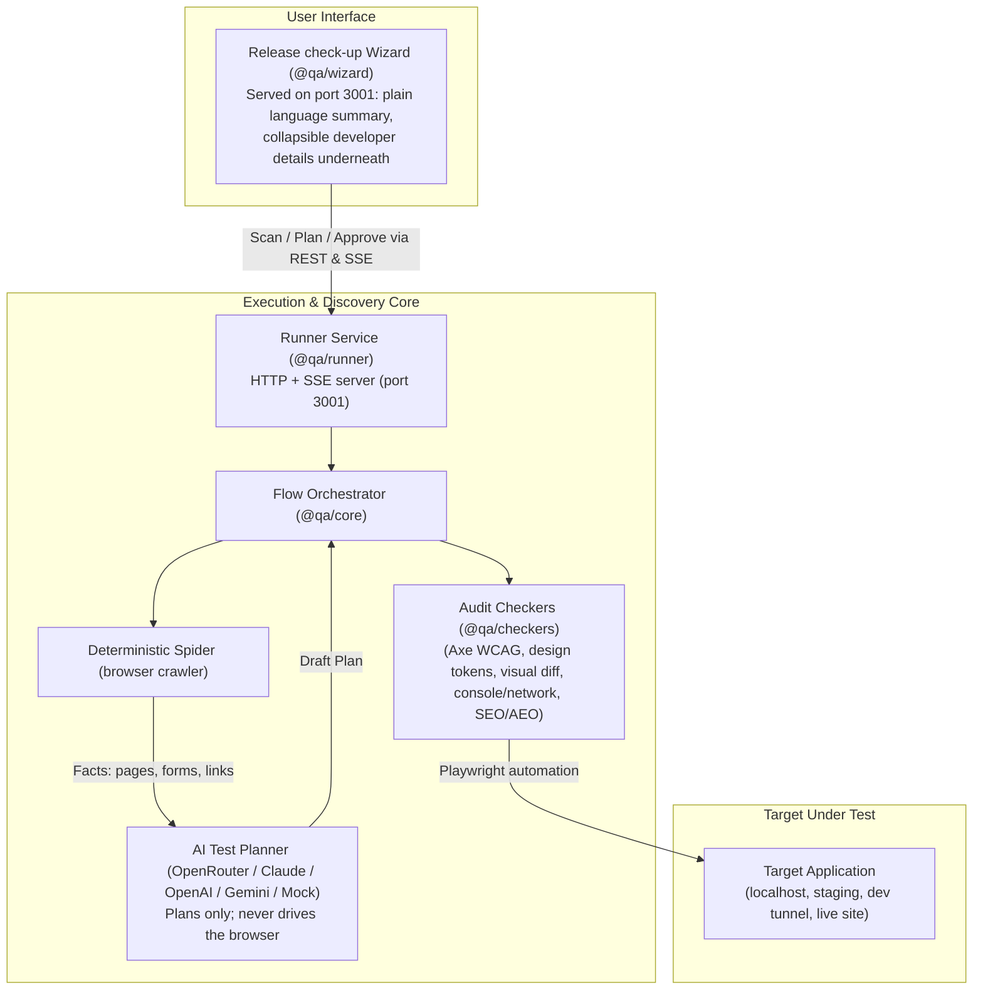
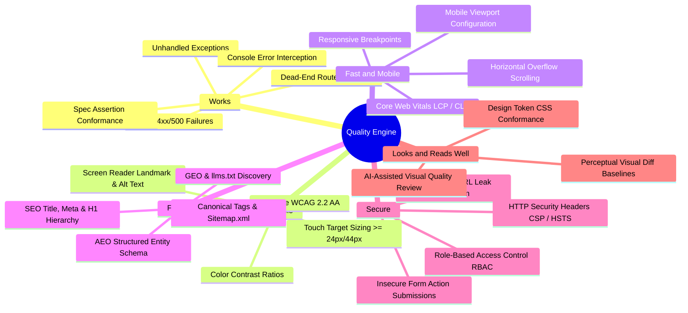
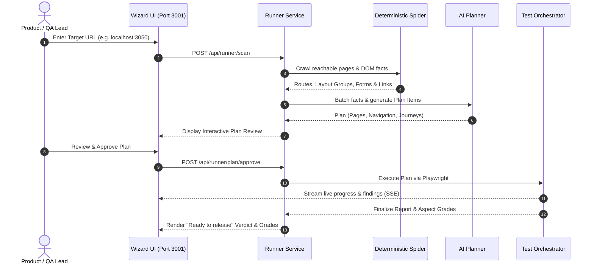

# QA Flow Tester / Pre-Release Readiness Checker 🧪

## Product Guide

How the product works and how to use it. For exact settings see [CONFIGURATION.md](CONFIGURATION.md), for the routes see [API.md](API.md), for the design see [ARCHITECTURE.md](ARCHITECTURE.md), and for hosting see [DEPLOYMENT.md](DEPLOYMENT.md).

---

## 📑 Table of Contents

1. [Executive Summary & High-Level Overview](#1-executive-summary--high-level-overview)
   - [Product Identity & Problem Statement](#product-identity--problem-statement)
   - [Core Value Proposition](#core-value-proposition)
   - [High-Level System Architecture](#high-level-system-architecture)
2. [Product Purpose & Target Audience](#2-product-purpose--target-audience)
   - [Mission & Philosophy](#mission--philosophy)
   - [Dual-Audience Design Architecture](#dual-audience-design-architecture)
3. [Core Features & System Capabilities](#3-core-features--system-capabilities)
   - [Autonomous AI Flow Discovery & Deterministic Spider](#autonomous-ai-flow-discovery--deterministic-spider)
   - [Complete Plan Review & Strict Safety Model](#complete-plan-review--strict-safety-model)
   - [Six-Pillar Audit Checker Suite](#six-pillar-audit-checker-suite)
   - [Deterministic Scoring & Release Verdict System](#deterministic-scoring--release-verdict-system)
   - [Checking a Fix](#checking-a-fix)
   - [Competitive Benchmarking & UX Friction Scoring](#competitive-benchmarking--ux-friction-scoring)
   - [Grouping Findings into Problems](#grouping-findings-into-problems)
4. [Technical Specifications & Architecture](#4-technical-specifications--architecture)
   - [Monorepo Package Topology](#monorepo-package-topology)
   - [State Management & Data Storage Architecture](#state-management--data-storage-architecture)
   - [AI Provider Abstraction (BYOK) & Token Economics](#ai-provider-abstraction-byok--token-economics)
   - [Test Isolation](#test-isolation)
5. [Setup, Installation & Configuration](#5-setup-installation--configuration)
   - [Prerequisites & System Requirements](#prerequisites--system-requirements)
   - [Quick Start Guide](#quick-start-guide)
   - [Environment Configuration (`.env`)](#environment-configuration-env)
   - [Deployment](#deployment)
6. [Step-by-Step Usage Guide](#6-step-by-step-usage-guide)
   - [Workflow A: The Release Check-up Wizard](#workflow-a-the-release-check-up-wizard)
   - [Workflow B: A Check-up from GitHub Actions](#workflow-b-a-check-up-from-github-actions)
   - [Workflow C: Competitive Flow Benchmarking](#workflow-c-competitive-flow-benchmarking)
7. [Best Practices & Operational Excellence](#7-best-practices--operational-excellence)
8. [Troubleshooting & Frequently Asked Questions (FAQ)](#8-troubleshooting--frequently-asked-questions-faq)
9. [Glossary of Terms](#9-glossary-of-terms)

---

## 1. Executive Summary & High-Level Overview

### Product Identity & Problem Statement

Modern web application releases frequently falter at the final mile. Engineering and product teams encounter a chronic trilemma:

1. **Manual QA is too slow and incomplete**: Pre-release sanity sweeps miss subtle regressions in responsive viewports, accessibility (WCAG), runtime telemetry, and cross-browser layouts.
2. **Scripted test suites (Playwright/Cypress) are expensive to maintain**: Locators break, test scripts degrade into technical debt, and edge journeys remain unwritten until a customer encounters a production defect.
3. **Siloed reporting creates release friction**: Non-technical stakeholders see confusing technical terminal dumps, while developers lack the exact DOM snapshots, network traces, console errors, and repro steps needed to quickly resolve issues.

**QA Flow Tester** (internally designated **Pre-Release Readiness Checker**) is a quality check-up tool for web apps. It discovers a web application's pages, crawls its user flows, writes a test plan with AI assistance, audits the app across six quality dimensions, and renders an unambiguous release verdict: **Ready to release** or **Not ready yet**.

### Core Value Proposition

- **Autonomous Discovery**: No test scripts required to start. A deterministic spider maps routes, elements, buttons, and links up to 200 pages, feeding structured facts to an AI planner.
- **Strict Safety & Human Oversight**: Live production sites are strictly read-only. Test copies (local, dev tunnel, staging) allow interactive form submissions. **Nothing executes without human approval of the test plan**.
- **Six-Pillar Quality Audit**: Audits functionality, accessibility (WCAG 2.2 AA via `axe-core`), speed/mobile readiness, search/AI discoverability (SEO, AEO, GEO), security, and design system fidelity.
- **Two-in-One Dual Experience**: Plain English summaries and letter grades (A–F) for product managers and leadership, with deep technical diagnostics (Playwright code snippets, repro steps, console logs) for engineers.
- **Deterministic Grouping**: Findings are grouped into problems by an invariant Structural Fingerprint, so one cause is one problem in the report.

### High-Level System Architecture



---

## 2. Product Purpose & Target Audience

### Mission & Philosophy

The mission of QA Flow Tester is to provide a **deterministic, zero-ambiguity release gate** that bridges the communication gap between business leadership and software developers.

It adheres to four foundational architectural principles (codified in system Architecture Decision Records):

1. **Facts Before AI (ADR 0009 & 0011)**: The browser is never blindly driven by unpredictable LLMs. A rule-based Deterministic Spider gathers exact DOM facts, layouts, links, and forms. The AI is consulted strictly to plan coverage, synthesize user journeys, and identify edge cases.
2. **Deterministic Safety (ADR 0003)**: Destructive actions (deletions, payments, external notifications) are guarded by safety filters. Live public sites are strictly constrained to Safe Interaction Mode.
3. **One Unified Application (ADR 0010)**: Non-technical users and core engineers use the exact same interface. Technical complexity is progressively disclosed on demand.
4. **Structural Invariance (ADR 0004)**: Defects are fingerprinted by their code structure, route, and selector, not by volatile timestamps or fluctuating ports.

### Dual-Audience Design Architecture

| Audience Persona                     | What They Need                                                               | What QA Flow Tester Delivers                                                                                                                                                                                                              |
| :----------------------------------- | :--------------------------------------------------------------------------- | :---------------------------------------------------------------------------------------------------------------------------------------------------------------------------------------------------------------------------------------- |
| **Product Managers & Release Leads** | High-level risk assessment, release readiness, and business impact.          | Unambiguous rubber stamp (**Ready to release** / **Not ready yet**), A–F letter grades across 6 quality areas, and plain-language summaries of problems without jargon.                                                                   |
| **Frontend & Fullstack Developers**  | Exact reproduction steps, code locations, and technical logs.                | Collapsible "Details for developers" under every finding, including DOM selectors, failing network requests, console stack traces, and **Copy bug report** and **Copy Playwright test** buttons. After a fix, **Test again** confirms it. |
| **QA Automation Engineers**          | Reusable specifications, determinism, and regression tracking.               | AI-written plans reused between check-ups, cross-breakpoint testing (375px, 768px, 1440px), visual baseline comparisons, and a plan you can download as Markdown.                                                                         |
| **Designers & Brand Custodians**     | Visual polish, brand consistency, and accessibility (automatic checks only). | Automated WCAG 2.2 AA audits, live `getComputedStyle()` comparison against design tokens (`design-tokens.json`), and perceptual visual regression diffs (`pixelmatch`).                                                                   |

---

## 3. Core Features & System Capabilities

### Autonomous AI Flow Discovery & Deterministic Spider

- **Rule-Based Crawling**: The Deterministic Spider crawls internal links up to a configurable ceiling (default 200 pages), clustering pages by DOM structural fingerprints into **Layout Groups** (e.g. template-based catalog pages like `/products/:id`).
- **Sample Page Efficiency**: Instead of wasting hours testing 500 identical product pages, the system selects three **Sample Pages** per Layout Group for full testing, while keeping the rest verified for navigational integrity.
- **AI Planning with Fact Grounding**: The AI Planner receives structured facts (discovered routes, interactive forms, buttons, links) and generates comprehensive **Plan Items** (Page visits, Navigation Checks, Journeys, and State-Aware checks). If an AI provider reaches a rate limit or token cap, the system automatically falls back to deterministic **Fixed-Rule Planning**.

### Complete Plan Review & Strict Safety Model

- **Explicit Human Sign-Off**: The tool never executes tests blindly. The user is presented with a complete, transparent interactive plan detailing every test point, viewport, and role before any test runs.
- **Test Copy vs. Live Site Detection**:
  - **Test Copy** (localhost, private subnets, dev tunnels, or explicitly confirmed staging environments): Full interactive testing is unlocked, including form completion and state mutation.
  - **Live Site**: Strictly constrained to read-only observation. Form submissions and state mutations are prevented.
- **Interactive Scope Control**: Users can toggle individual tests, pages, or entire journeys on or off, add custom manual journeys, or re-plan specific sections with the AI prior to execution.

### Six-Pillar Audit Checker Suite



1. **Works (`bug-detection`, `spec-conformance`)**:
   - Catches unhandled browser console errors, failed background AJAX/fetch calls (HTTP 4xx, 5xx), broken navigation links, and dead-end pages.
   - Evaluates custom business expectations (URL transitions, text presence, element states).
2. **Accessible (`ux-quality`)**:
   - Executes automated WCAG 2.2 AA evaluations using `axe-core`.
   - Flags mobile usability issues: tap targets smaller than 24×24px (or 44×44px for primary controls) and missing form labels.
3. **Fast and Mobile (`performance`)**:
   - Evaluates Core Web Vitals (Largest Contentful Paint, Cumulative Layout Shift, Total Transfer Size).
   - Detects responsive layout breakages, such as content overflowing horizontally at 375px mobile viewport widths.
4. **Findable (`seo`, `aeo`, `geo`)**:
   - **SEO**: Validates title tags, meta descriptions, single `<h1>` hierarchy, canonical tags, OpenGraph previews, and `robots.txt`/`sitemap.xml`.
   - **AEO (Answer Engine Optimization)**: Audits structured data (`JSON-LD`, microdata) to ensure content can be indexed by AI search agents.
   - **GEO (Generative Engine Optimization)**: Checks for `llms.txt` and machine-readable markdown endpoint guides.
5. **Secure (`security`, `permission-matrix`)**:
   - Detects severe authentication leaks, such as passwords submitted as URL query parameters.
   - Validates essential security headers: Content-Security-Policy (CSP), Strict-Transport-Security (HSTS), X-Content-Type-Options.
   - Checks role-based access across the signed-in roles of a check-up, to catch horizontal/vertical privilege escalation.
6. **Looks and Reads Well (`design-standards`, `ai-review`)**:
   - **Tier 1 Design Token Auditing**: Validates computed CSS styles (`getComputedStyle()`) against committed `design-tokens.json` values (colors, border-radii, typography).
   - **Tier 2 Visual Baseline Diffing**: Compares captured Playwright viewport snapshots against approved visual baseline images using `pixelmatch` anti-aliasing filters.
   - **AI Visual Review**: Uses vision-capable models to review page layout harmony, text readability, and visual hierarchy.

### Deterministic Scoring & Release Verdict System

- **100-Point Scoring Model**: Each of the six aspects begins at 100 points. Deductions are strictly weighted by severity:
  - **Blocker**: -30 points (and caps aspect at 65 for 1 blocker; 2+ blockers force an **F** grade / max 50 points).
  - **Major**: -15 points.
  - **Minor**: -5 points.
  - **Suggestion**: -2 points.
- **Spread Multipliers**: Defects recurring across multiple pages apply spread multipliers (1.0× for 1 page, 1.25× for 2–4 pages, 1.5× for 5+ pages) to prevent duplicate penalties while acknowledging systemic bugs.
- **The Rubber Stamp Verdict**:
  - **Ready to release**: Granted only when active release gates are satisfied (zero blockers and zero unmitigated majors under standard gate criteria).
  - **Not ready yet**: Rendered when critical issues remain unresolved, accompanied by a precise count of required fixes.

### Checking a Fix

When a developer fixes a problem, they run the check-up again on the same address. **Test again** scans the site again and reuses the plan you approved. If nothing changed, testing starts at once; if something did, only what is new waits for your review. The fixed finding should no longer appear in the new report. Every report is kept under **Past check-ups**.

### Competitive Benchmarking & UX Friction Scoring

The Benchmark screen (`POST /api/runner/benchmark`, see [API.md](API.md)) performs head-to-head UX audits between your own flow and a competitor's public flow:

- **Safe Interaction Mode**: Navigates public websites safely without submitting forms or triggering external state changes.
- **Friction Scorecard**: Quantifies user effort across Total Steps, Input Fields Count, Required Fields Count, Click Depth, and a composite **Friction Index**.
- **Interactive Pattern Parity**: Automatically evaluates support for key modern UX patterns (e.g. single-click submit, inline validation, social authentication, guest checkout).
- **AI UX Gap Recommendations**: Generates prioritized, high-impact/low-effort design recommendations to optimize conversion rates.

### Grouping Findings into Problems

Findings that share a Structural Fingerprint (ADR 0004) are grouped into one problem within a check-up, so the report shows one clear problem instead of dozens of repeats. See step 7 of [ARCHITECTURE.md](ARCHITECTURE.md).

---

## 4. Technical Specifications & Architecture

### Monorepo Package Topology

```
qa-flow-tester/
├── packages/
│   ├── types/          # Shared TypeScript interfaces, verdict schemas, and problem definitions
│   ├── core/           # Test orchestrator, AI agent, planner, spider, and benchmark engine
│   ├── checkers/       # Automated audit rules (WCAG axe-core, tokens, SEO, AEO, security, perf)
│   ├── runner/         # HTTP/SSE server, scheduling, static wizard UI, and the CI check-up (checkup.ts)
│   └── wizard/         # React + Vite "Release check-up" single-page application
├── fixtures/
│   └── test-app/       # Built-in reference application with planted defects
└── scripts/
    └── benchmark.ts    # Automated defect detection accuracy harness
```

### State Management & Data Storage Architecture

| Location                          | Purpose                                                                           | Persistence Type                       |
| :-------------------------------- | :-------------------------------------------------------------------------------- | :------------------------------------- |
| `.qa-data/`                       | Approved test plans, user preferences, and historical grade trends.               | Local filesystem (JSON)                |
| `.qa-runner-report/runs/<runId>/` | Individual check-up reports, screenshots, traces, and single-file HTML summaries. | Local filesystem (Markdown, JSON, PNG) |
| `.qa-baselines/`                  | Approved visual reference screenshots for perceptual diff comparisons.            | Local filesystem (PNG)                 |

### AI Provider Abstraction (BYOK) & Token Economics

The core engine provides a unified interface (`AIProvider`) supporting multiple LLM backends:

- **Supported Providers**: Anthropic Claude, OpenAI, Google Gemini, OpenRouter, and an offline deterministic `MockAIProvider`.
- **BYOK (Bring Your Own Key)**: Keys can be supplied via environment variables or pasted directly into the Wizard.
- **Paced AI & Budget Guardrails**:
  - Automatically paces requests below rate limits (e.g., 20 requests/minute for free tiers).
  - Pre-estimates total required requests before scanning starts.
  - Automatically falls back to deterministic rule-based planning if the daily budget is exhausted or if a model encounters token truncation.

### Test Isolation

Every test execution occurs inside an isolated Playwright `BrowserContext` with zero shared cache, cookies, or local storage.

---

## 5. Setup, Installation & Configuration

### Prerequisites & System Requirements

- **Node.js**: `v20.x` or `v22.x` LTS
- **Package Manager**: `pnpm` v9+ (`npm install -g pnpm` or `corepack enable`)
- **Operating System**: macOS, Linux, or Windows (WSL2 or PowerShell)
- **Browser Dependencies**: Playwright Chromium binary (`pnpm bootstrap` installs this automatically)

### Quick Start Guide

#### 1. Clone & Bootstrap the Workspace

```bash
git clone https://github.com/CJCreator/qa-flow-tester.git
cd qa-flow-tester

# Installs dependencies, downloads Playwright browser binaries, and builds all packages
pnpm bootstrap
```

#### 2. Start the Interactive QA Tool

```bash
pnpm start
```

This builds anything that is missing and opens the **Release check-up Wizard** in your default browser at `http://localhost:3001/`.

### Environment Configuration (`.env`)

Create a local `.env` file from the provided template:

```bash
cp .env.example .env
```

Key settings (all optional on your own computer; the full list is in [CONFIGURATION.md](CONFIGURATION.md)):

```ini
# AI provider keys (at least one, or the plan is written by fixed rules)
OPENROUTER_API_KEY=
ANTHROPIC_API_KEY=
OPENAI_API_KEY=
GEMINI_API_KEY=

# The QA Tool server
RUNNER_PORT=3001
RUNNER_HOST=localhost
```

### Deployment

- **Docker**: `packages/runner/Dockerfile` builds the QA Tool as one container.
- **Render (free, shared beta)**: `render.yaml` publishes the runner and wizard together.
- **Vercel**: publishes the front end only (`vercel.json`).
- **GitHub Actions**: `templates/qa-check.yml` runs one check-up in your own repo.

Details, secrets and the automatic deploy workflow are in [DEPLOYMENT.md](DEPLOYMENT.md).

---

## 6. Step-by-Step Usage Guide

### Workflow A: The Release Check-up Wizard



1. **Start Check-up**: Navigate to `http://localhost:3001/`. Enter your target web application address (e.g. `localhost:3050`).
2. **Environment Classification**:
   - The system inspects the URL. If it resides on `localhost`, a private IP, or a dev tunnel, it is designated a **Test copy** (interactive testing unlocked).
   - If pointing to an external domain, tick **This is a test copy** and **I own this site** if safe to submit forms; otherwise, it runs in read-only observation mode.
3. **Execute Scan**: Click **Scan the site**. Watch real-time progress indicators displaying discovered pages, clustered layout groups, and remaining AI request budgets.
4. **Interactive Plan Review**:
   - Inspect the **Full plan** tab: verify planned page visits, navigation checks, and cross-page journeys.
   - Switch any unwanted tests off or click **Re-plan** to refine specific tests with AI instructions.
   - Switch to the **Map** tab to visually explore the site graph.
5. **Approve & Run**: Click **Approve and run**. Watch tests execute live with real-time test counters, active browser screenshots, and streaming findings.
6. **Evaluate Release Verdict**:
   - Review the inspector's rubber stamp: **Ready to release** (green) or **Not ready yet** (red).
   - Inspect the six aspect letter grades (A–F).
   - Expand any problem to reveal **Details for developers** (screenshots, steps to reproduce, **Copy bug report**, **Copy Playwright test**).
7. **Test again** after a fix (see [Checking a Fix](#checking-a-fix)).

### Workflow B: A Check-up from GitHub Actions

Open the wizard where it is published on Vercel and choose **In your GitHub repo**. It gives you a workflow file (the same one as [templates/qa-check.yml](../templates/qa-check.yml)) to save as `.github/workflows/qa-check.yml`. Then:

1. Add your AI key as a repo secret named `QA_AI_API_KEY` (optional: without it the plan is written by fixed rules).
2. Run **QA check-up** from the Actions tab and type the address. It also runs when a preview or staging deployment succeeds.
3. The verdict is on the run's summary page. Download the **qa-report** artifact and open `report.html`.

A preview or staging address is tested as a test copy; any other address is checked read-only. To run the same thing yourself:

```bash
node packages/runner/dist/checkup.js https://preview.example.com --staging --fail-on blocker
```

`--fail-on` takes `blocker`, `major` or `none` and sets when the build fails. See [ADR 0012](adr/0012-hosted-runner-github-actions.md) and [CONFIGURATION.md](CONFIGURATION.md).

### Workflow C: Competitive Flow Benchmarking

Open the Benchmark screen, enter your own address and a competitor's public address, and pick the flow type. The runner compares the two flows (`POST /api/runner/benchmark`; past comparisons are listed by `GET /api/runner/benchmarks`) and produces:

- A friction comparison table.
- A scorecard with the Friction Index and pattern parity results.
- AI recommendations for closing the gaps.

---

## 7. Best Practices & Operational Excellence

1. **Adopt Robust Test Locators**: Always favor dedicated `data-testid` attributes (e.g. `data-testid="submit-invoice"`) over volatile CSS classes or nested DOM paths. Structural fingerprinting relies on stable locators for accurate grouping across refactors.
2. **Respect the Safety Model**: Never mark a public production site as a "Test Copy" unless you have explicit authorization and dedicated test accounts.
3. **Curate Sample Pages**: For large catalog or content applications, rely on Layout Groups so that testing focuses on 2–3 sample pages rather than hundreds of repetitive URLs.
4. **Manage AI Token Economics**: Use free OpenRouter tiers for initial explorations, or configure an OpenAI / Anthropic key for high-volume pipelines. Fixed-rule planning is always available as a cost-free fallback.
5. **Check Every Fix**: After each bug fix, use **Test again** on the same address and confirm the finding is gone before closing the pull request.

---

## 8. Troubleshooting & Frequently Asked Questions (FAQ)

### Troubleshooting Guide

#### 1. Port 3001 is Occupied

- **Symptom**: `pnpm start` displays an error that port 3001 is in use.
- **Solution**: Terminate the occupying process or specify an alternative port:
  ```powershell
  # PowerShell
  $env:RUNNER_PORT=3055; pnpm start
  ```
  ```bash
  # Bash / zsh
  RUNNER_PORT=3055 pnpm start
  ```

#### 2. Playwright Browser Launch Errors

- **Symptom**: `Executable doesn't exist at .../playwright/chromium`.
- **Solution**: Install browser binaries and OS dependencies:
  ```bash
  pnpm --filter @qa/core exec playwright install chromium --with-deps
  ```

#### 3. Windows Telemetry Hook Bundle Error

- **Symptom**: `Cannot find module '...telemetry_hook_bundle.js'`.
- **Solution**: Reset the invalid hook configuration in PowerShell:
  ```powershell
  Set-Content -Path "$HOME\.gemini\config\plugins\googlecloudtools.datacloud_telemetry\hooks.json" -Value "{}"
  ```

#### 4. Element Timeout Errors (`TimeoutError: waiting for selector ... 30000ms exceeded`)

- **Symptom**: Playwright fails to find a selector within the default timeout.
- **Solution**: Verify the target app is actively serving traffic. Ensure elements are not housed inside cross-origin `iframe` containers, and check for loading spinners delaying DOM interactivity.

---

### Frequently Asked Questions (FAQ)

**Q: Does QA Flow Tester send proprietary code or sensitive customer data to external AI models?**  
A: No. The Deterministic Spider only extracts high-level DOM structural facts (tag names, IDs, form action endpoints, link texts). Application source code is never transmitted. If you require complete air-gapped isolation, you can operate entirely using the `mock` AI provider and deterministic fixed rules.

**Q: Can QA Flow Tester test single-page applications (SPAs) with complex authentication?**  
A: Yes. The orchestrator natively handles client-side routing, cookies, session storage, and JWT bearer tokens. Enter sign-ins in the Wizard when you start a check-up.

**Q: How does the platform avoid submitting destructive actions during discovery?**  
A: Destructive actions are governed by two distinct safeguards:

1. Public live sites are restricted to Safe Interaction Mode (form submissions and mutations are blocked).
2. The safety filter skips destructive actions (such as delete or purchase buttons) deterministically, in every check-up.

**Q: What is the difference between a "Finding" and a "Problem"?**  
A: A **Finding** is a raw technical violation detected at a specific line or DOM node. A **Problem** is a user-centric grouping of identical findings across pages (e.g., if a missing favicon occurs across 40 pages, developers see 40 technical findings, but the release report groups them into a single clear problem: _"The site has no icon for browser tabs and search results"_).

---

## 9. Glossary of Terms

| Term                       | Definition                                                                                                                                               |
| :------------------------- | :------------------------------------------------------------------------------------------------------------------------------------------------------- |
| **Deterministic Spider**   | Rule-based browser crawler that gathers DOM facts, links, and forms without making AI-driven decisions.                                                  |
| **AI Planner**             | Intelligent planning layer that receives crawl facts and synthesizes structured Plan Items (page visits, navigation checks, journeys).                   |
| **Check-up**               | A complete evaluation cycle covering site scanning, plan review, automated testing, and report generation.                                               |
| **Plan Item**              | A single atomic test entry in the approved test plan (e.g. a page visit, navigation check, or multi-step journey).                                       |
| **Plan Review**            | The screen where you inspect, change and approve the whole plan before anything is tested.                                                               |
| **Navigation Check**       | A test item that simulates a user clicking a navigation link or button and verifies that the destination page loads successfully.                        |
| **Layout Group**           | A cluster of pages sharing the same structural DOM template (e.g. `/products/:id`), evaluated efficiently via Sample Pages.                              |
| **Sample Page**            | A representative page selected from a Layout Group for deep testing on behalf of the entire group.                                                       |
| **Fixed-Rule Fallback**    | Deterministic rule-based planning applied when AI budgets, quotas, or token limits are reached.                                                          |
| **Structural Fingerprint** | An invariant hash derived from a finding's route, checker, rule code, and DOM selector, used to group identical findings into one problem.               |
| **Test Copy**              | A safe, non-production environment (localhost, private network, dev tunnel, or designated staging server) where interactive form testing is permitted.   |
| **Safe Interaction Mode**  | A restricted crawling policy that explores client-side controls (tabs, menus, toggles) while strictly prohibiting form submissions and state mutations.  |
| **Friction Scorecard**     | A quantitative metric evaluating user effort across a user flow (total steps, input fields, required inputs, click depth, and composite friction index). |
| **Rubber Stamp Verdict**   | The authoritative, high-level release decision rendered by the quality engine: **Ready to release** or **Not ready yet**.                                |
